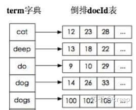

# ES

https://zhuanlan.zhihu.com/p/102500311
---

## 调优

* 合理分词
* 使用SSD存放热数据,冷数据定期 force_merge 加 shrink 压缩
* 写入
    * 写入前关闭自动刷新
    * bulk写入
* 查
    * 禁止`wildcard`和批量`terms`
    * 尽量设置为`keyword`类型

## 倒排索引

基于FST实现的O(1)的查询方式

