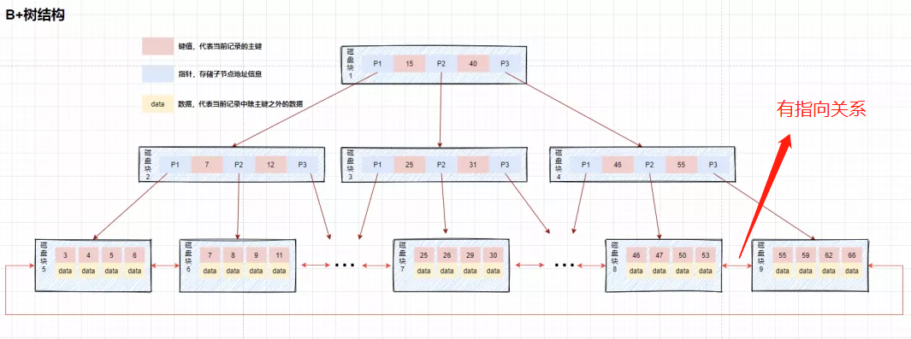

# MySQL

---

## 范式

* ***1NF***：字段原子
* ***2NF***：有主键
* ***3NF***：非主键字段互不依赖

## [索引](https://mp.weixin.qq.com/s/faOaXRQM8p0kwseSHaMCbg)

### 优缺点

* ***优***：
    * 随机IO→顺序IO，加快检索
    * 便于排序和分组（`B+树`叶节点顺序性）
* ***劣***：
    * 索引占用存储空间（约data的1.5倍）
    * 修改操作变慢，因为在修改数据表的同时还需要修改索引表

### 种类

* ***聚簇（主键）***：**不可重复**，**不可包含空值**，**物理地址连续**。未指定主键时，InnoDB会选择第一个不为NULL的唯一索引列用作聚簇索引，若没有则生成6byte隐式字段`_rowid`，随数据插入递增
* ***非聚簇***：叶子节点的 data 记录主键，需要回表（先找到主键，再到聚簇索引中查找）
    * ***唯一***：允许`NULL`
    * ***普通***
    * ***组合***：用多个列组合构建的索引，不允许`NULL`
    * ***全文***：便于对长文本字段进行查询      ~~P.S. 为什么不用ES？~~
    * ***哈希***：O(1)，只能精确查找，不能排序、分组、范围查找
        * ***自适应***：某个索引值被使用得非常频繁时，会额外创建一个哈希索引
    * ***空间***：5.7之后支持OpenGIS几何数据模型

### 数据结构



* 非叶子节点带有***主键***
* 所有叶节点位于同一层，数据只存储在叶子节点上
* 左子树的所有key都＜父节点，右子树中的key都≥父节点，叶子节点的key从小到大递增，形成***双向链表***

#### 为什么不用其他结构

* **B树**：不无法只通过遍历叶子节点获取所有数据，范围查找性能不稳定
* **红黑树**：是因为它查询速度稍慢，树较高（IO多）
* **AVL（平衡二叉树）**：它严格平衡。树高差不能超过1，不满足则需要时间旋转，耗时

### 小表不建索引

若查询的数据不是索引的构成部分也不是主键，直接遍历表比走索引要快（因为需要回表）。

### 无法命中

* 查询条件中有`or`、`not in`、`not exist`等
* 小表查询
* `like '%关键词'`
* 查询条件是字符串但未使用`'`将其括起来
* 函数计算
* 无查询条件

##### 是否会用到索引的原则

取决于Mysql优化器认为全表扫描是否更快

##### 最左前缀匹配

* 查询条件的第一列必须是联合索引起始列，且在顺序被打破时及之后使用不到
* （`>`、`<`、`between`、`like`）的列可以用到，后面的列用不到
* `like '关键词%` 可以使用索引，但`like '%关键词%`不会使用索引（***全表扫描***）

### 创建原则

* 最适合创建索引的列是出现在`WHERE`或`ON`子句中的列，或连接子句中的列而不是出现在`SELECT`后的列。
* 索引列的基数越大，数据区分度越高，效果越明显。
* 对于字符串进行索引，应该制定一个前缀长度，可以节省大量的索引空间。
* 适时创建联合索引
* 索引不宜太多，索引会额外占用磁盘空间，降低写操作效率。
* 主键尽可能选择较短的数据类型，可以有效减少索引的磁盘占用提高查询效率。

---

## 引擎

|       |    InnoDB     |    MyISAM    | Memory | CSV | Archive |
|:-----:|:-------------:|:------------:|:------:|:---:|:-------:|
|  事务   |       √       |      ×       |        |     |         |
|  外键   |       √       |      ×       |        |     |         |
|  默认   |    ver>5.4    |   ver<5.5    |        |     |         |
|   锁   |     行锁、表锁     |      表锁      |        |     |         |
| 崩溃后恢复 |      容易       |      难       |        |     |         |
| 索引形式  | data和index在一起 | data和index分离 |        |     |         |
| 全文索引  |    5.6起支持     |      支持      |        |     |         |

## 锁

### 类型

* ***行锁***:
    * 排他锁(写锁, X锁)：

      会阻塞其他事务读和写. 若事务T对数据对象A加上X锁，则只允许T读取和修改A，T释放A上的锁之前其他任何事务都不能再对A加任何类型的锁

    * 共享锁(读锁, S锁)：

      会阻塞其他事务修改表数据。 若事务T对数据对象A加上S锁，则其他事务在T释放A上的锁之前只能再对A加S锁，而不能加X锁。这就保证了其他事务可以读A，但在T释放A上的S锁之前不能对A做任何修改

  X锁和S锁都是加载某一个数据对象上的。也就是数据的粒度
* ***表锁***:
    * 意向共享锁（IS）：事务打算给数据行共享锁，事务在给一个数据行加共享锁前必须先取得该表的IS锁
    * 意向排他锁（IX）：事务打算给数据行加排他锁，事务在给一个数据行加排他锁前必须先取得该表的IX锁

### 粒度

* ***行级锁***：
    * 开销大，加锁慢、可能死锁
    * 粒度最小，锁冲突概率低
    * 并发度高

      行级锁的颗粒度是目前最小的，因此发生锁定资源争用的概率也最小，并发能力高。 但是每次获取锁和释放锁需要做的事情也更多，消耗更大，容易死锁。

* ***表级锁***：
    * 开销小，加锁快
    * 不会死锁
    * 粒度大，锁冲突概率高，并发度低

* ***页级锁（MySQL特有）***：
    * 开销和加锁时间界于表锁和行锁之间
    * 会出现死锁
    * 锁定粒度界于表锁和行锁之间，并发度一般

---   

## 事务

### 特性

* **原子性（***A***tomicity）**：一个事务要么全部执行完，要么一点儿也不执行.
* **一致性（***C***onsistency）**：事务的运行并不改变数据库中数据的一致性，例如,完整性约束了`a+b=10`，一个事务改变了`a`,那么`b`也应该随之改变
* **隔离性（***I***solation）**: 多个事务不会出现交错执行的状态，造成数据不一致
* **持久性（***D***urability）**: 提交的修改不会因为宕机消失，也不会无缘无故的回滚（`redo`日志用来在断电/数据库崩溃等状况发生时重演一次刷数据的过程，把`redo`日志里的数据刷到数据库里）

### 隔离级别

| 是否会发生                                    | 脏读（A事务修改x=1为x=2后尚未提交至DB，B事务读取到x=1） | 重复读（A、B两个事务同时读取，A读取x=1后B修改x=2，A再次读取，x=2） | 幻读（A查询x=1的记录，B新增了1条x=1的记录，A再次查询，结果数变化了） |
|:-----------------------------------------|:----------------------------------:|:----------------------------------------:|:---------------------------------------:|
| **R**ead **U**nCommitted（可读未提交）          |                 √                  |                    √                     |                    √                    |
| **R**ead **C**ommitted（只读已提交，`Oracle`默认） |                 ×                  |                    √                     |                    √                    |
| **R**epeatable **R**ead（重复读一致，`MySQL`默认） |                 ×                  |                    ×                     |           √（可通过`next-key`避免）            |
| Serializable（读写锁表）                       |                 ×                  |                    ×                     |                    ×                    |

### 快照读、当前读

- 快照读：无锁的`select`
- 当前读
    - 排它锁：`insert`、`update`、`delete`、`select ...for update`
    - 共享锁：`select ...lock in share mode`

### mvcc

[详解](https://mp.weixin.qq.com/s/CZHuGT4sKs_QHD_bv3BfAQ)

多版本并发控制（Multi-Version Concurrency Control），相当于**乐观锁**，依赖以下内容

- 实现
    - **隐藏列**：`InnoDB`中，在每行记录都有2-3个隐藏列：
        - 最近事务`DB_TRX_ID（6B）`：每个事务向`InnoDB`的事务系统申请一个自增的事务ID，并写入到受影响的行。`delete`会标记`Record header`中的`deleted_flag`字段为**已删除**
        - 回滚指针`DB_ROLL_PTR（7B）` 指向该行的 `undo log` 。如果该行未被更新，则为空
        - 隐式主键`DB_ROW_ID（6B）`：如果没有设置主键且该表没有唯一非空索引时，会自增
    - `Read View`
        - 下限ID（`m_low_limit_id`）：下一个下发的事务ID，不小于这个 ID 的数据版本均不可见
        - ID区间（`m_ids`）：`Read View` 创建时保存下**其他**未提交的活跃事务ID，屏蔽它们后续的修改对本事务的可见性
        - 上限ID（`m_up_limit_id`）： 小于这个ID的数据版本均可见，取值方式
        ```python
            m_up_limit_id=min(m_ids) if m_ids else m_up_limit_id
        ```
        - 创建者ID（`m_creator_trx_id`）：创建该 `Read View` 的事务 ID

          
    - `undo-log`
        - 作为**事务回滚**的依据
        - 充当历史版本实现**快照读**
        - `insert undo log`在事务提交后会删除，`update undo log`会形成越新越靠前的单向链表

- RR和RC下的区别
    - RC
      
        1. `T4`时数据行`id = 1`的版本链为
           

           由于 RC 下每次查询都会生成`Read View`，并且事务101、102 并未提交，此时

           > `m_ids`=[101,102]
           >
           > `m_low_limit_id`=104
           >
           > `m_up_limit_id`=101
           >
           > `m_creator_trx_id`=103
           >
           > 最新记录的 `DB_TRX_ID` = 101

            - 因为`m_up_limit_id` <= 101 < `m_low_limit_id`，所以要在 `m_ids` 列表中查找，发现 `DB_TRX_ID` 存在列表中，那么这个记录**不可见**

            - 根据 `DB_ROLL_PTR` 找到 `undo log` 中的上一版本记录，上一条记录的 `DB_TRX_ID` 还是 101，**不可见**

            - 继续找上一条 `DB_TRX_ID`为 1，满足 1 < `m_up_limit_id`，**可见**，所以事务 103 查询到数据为 `name = 菜花`

        2. `T6`时数据行`id = 1`的版本链为
           

           因为在 RC 下每次`SELECT`重新生成 `Read View`，这时事务 101 已经提交，102 并未提交，所以此时

           > `m_ids`=[102]
           >
           > `m_low_limit_id`=104
           >
           > `m_up_limit_id`=102
           >
           > `m_creator_trx_id`=103
           >
           > 最新记录的 `DB_TRX_ID` = 102

            - `m_up_limit_id` <= 102 < `m_low_limit_id`，所以要在 `m_ids` 列表中查找，发现 `DB_TRX_ID` 存在列表中，那么这个记录**不可见**

            - 根据 `DB_ROLL_PTR` 找到 `undo log` 中的上一版本记录，上一条记录的 `DB_TRX_ID` 为 101，满足 101 < `m_up_limit_id`，记录**可见**，所以在 `T6` 时间点查询到数据为 `name = 李四`，与时间 `T4` 查询到的结果不一致，**不可重复读**！

        3. `T9`时数据行`id = 1`的版本链为
           

           因为在 RC 下每次`SELECT`重新生成 `Read View`，这时事务 101、102已提交，所以此时

           > `m_ids`=[]
           >
           > `m_low_limit_id`=104
           >
           > `m_up_limit_id`=104
           >
           > `m_creator_trx_id`=103
           >
           > 最新记录的 `DB_TRX_ID` = 102

            - 满足 102 < m_low_limit_id，**可见**，查询结果为 `name = 赵六`
  > **总结：RC下，事务在每次查询开始时都会生成并设置新的 Read View，所以导致不可重复读**

- RR和RC下的区别

  
    - RC
        1. `T4`时数据行`id = 1`的版本链为
           

           由于 RC 下每次查询都会生成`Read View`，并且事务101、102 并未提交，此时

           > `m_ids`=[101,102]
           >
           > `m_low_limit_id`=104
           >
           > `m_up_limit_id`=101
           >
           > `m_creator_trx_id`=103
           >
           > 最新记录的 `DB_TRX_ID` = 101

            - 因为`m_up_limit_id` <= 101 < `m_low_limit_id`，所以要在 `m_ids` 列表中查找，发现 `DB_TRX_ID` 存在列表中，那么这个记录**不可见**

            - 根据 `DB_ROLL_PTR` 找到 `undo log` 中的上一版本记录，上一条记录的 `DB_TRX_ID` 还是 101，**不可见**

            - 继续找上一条 `DB_TRX_ID`为 1，满足 1 < `m_up_limit_id`，**可见**，所以事务 103 查询到数据为 `name = 菜花`

        2. `T6`时数据行`id = 1`的版本链为
           

           因为在 RC 下每次`SELECT`重新生成 `Read View`，这时事务 101 已经提交，102 并未提交，所以此时

           > `m_ids`=[102]
           >
           > `m_low_limit_id`=104
           >
           > `m_up_limit_id`=102
           >
           > `m_creator_trx_id`=103
           >
           > 最新记录的 `DB_TRX_ID` = 102

            - `m_up_limit_id` <= 102 < `m_low_limit_id`，所以要在 `m_ids` 列表中查找，发现 `DB_TRX_ID` 存在列表中，那么这个记录**不可见**

            - 根据 `DB_ROLL_PTR` 找到 `undo log` 中的上一版本记录，上一条记录的 `DB_TRX_ID` 为 101，满足 101 < `m_up_limit_id`，记录**可见**，所以在 `T6` 时间点查询到数据为 `name = 李四`，与时间 `T4` 查询到的结果不一致，**不可重复读**！

        3. `T9`时数据行`id = 1`的版本链为
           

           因为在 RC 下每次`SELECT`重新生成 `Read View`，这时事务 101、102已提交，所以此时

           > `m_ids`=[]
           >
           > `m_low_limit_id`=104
           >
           > `m_up_limit_id`=104
           >
           > `m_creator_trx_id`=103
           >
           > 最新记录的 `DB_TRX_ID` = 102

            - 满足 102 < m_low_limit_id，**可见**，查询结果为 `name = 赵六`
  > **总结：RC下，事务在每次查询开始时都会生成并设置新的 Read View，所以导致不可重复读**
    - RC
      
        1. `T4`时数据行`id = 1`的版本链为
           

           由于 RC 下每次查询都会生成`Read View`，并且事务101、102 并未提交，此时

           > `m_ids`=[101,102]
           >
           > `m_low_limit_id`=104
           >
           > `m_up_limit_id`=101
           >
           > `m_creator_trx_id`=103
           >
           > 最新记录的 `DB_TRX_ID` = 101

            - 因为`m_up_limit_id` <= 101 < `m_low_limit_id`，所以要在 `m_ids` 列表中查找，发现 `DB_TRX_ID` 存在列表中，那么这个记录**不可见**

            - 根据 `DB_ROLL_PTR` 找到 `undo log` 中的上一版本记录，上一条记录的 `DB_TRX_ID` 还是 101，**不可见**

            - 继续找上一条 `DB_TRX_ID`为 1，满足 1 < `m_up_limit_id`，**可见**，所以事务 103 查询到数据为 `name = 菜花`

        2. `T6`时数据行`id = 1`的版本链为
           

           因为在 RC 下每次`SELECT`重新生成 `Read View`，这时事务 101 已经提交，102 并未提交，所以此时

           > `m_ids`=[102]
           >
           > `m_low_limit_id`=104
           >
           > `m_up_limit_id`=102
           >
           > `m_creator_trx_id`=103
           >
           > 最新记录的 `DB_TRX_ID` = 102

            - `m_up_limit_id` <= 102 < `m_low_limit_id`，所以要在 `m_ids` 列表中查找，发现 `DB_TRX_ID` 存在列表中，那么这个记录**不可见**

            - 根据 `DB_ROLL_PTR` 找到 `undo log` 中的上一版本记录，上一条记录的 `DB_TRX_ID` 为 101，满足 101 < `m_up_limit_id`，记录**可见**，所以在 `T6` 时间点查询到数据为 `name = 李四`，与时间 `T4` 查询到的结果不一致，**不可重复读**！

        3. `T9`时数据行`id = 1`的版本链为
           

           因为在 RC 下每次`SELECT`重新生成 `Read View`，这时事务 101、102已提交，所以此时

           > `m_ids`=[]
           >
           > `m_low_limit_id`=104
           >
           > `m_up_limit_id`=104
           >
           > `m_creator_trx_id`=103
           >
           > 最新记录的 `DB_TRX_ID` = 102

            - 满足 102 < m_low_limit_id，**可见**，查询结果为 `name = 赵六`
      > **总结：RC下，事务在每次查询开始时都会生成并设置新的 Read View，所以导致不可重复读**
    - RR
        1. `T4`时数据行`id = 1`的版本链为
           

           由于 RR 下初次查询会生成`Read View`，并且事务101、102 并未提交，此时

           > `m_ids`=[101,102]
           >
           > `m_low_limit_id`=104
           >
           > `m_up_limit_id`=101
           >
           > `m_creator_trx_id`=103
           >
           > 最新记录的 `DB_TRX_ID` = 101

            - 因为`m_up_limit_id` <= 101 < `m_low_limit_id`，所以要在 `m_ids` 列表中查找，发现 `DB_TRX_ID` 存在列表中，那么这个记录**不可见**

            - 根据 `DB_ROLL_PTR` 找到 `undo log` 中的上一版本记录，上一条记录的 `DB_TRX_ID` 还是 101，**不可见**

            - 继续找上一条 `DB_TRX_ID`为 1，满足 1 < `m_up_limit_id`，**可见**，所以事务 103 查询到数据为 `name = 菜花`

        2. `T6`时数据行`id = 1`的版本链为
           

           因为在 RR 非首次`SELECT`不生成 `Read View`，这时事务 101 已经提交，102 并未提交，所以此时

           > `m_ids`=[101,102]
           >
           > `m_low_limit_id`=104
           >
           > `m_up_limit_id`=101
           >
           > `m_creator_trx_id`=103
           >
           > 最新记录的 `DB_TRX_ID` = 102

            - `m_up_limit_id` <= 102 < `m_low_limit_id`，所以要在 `m_ids` 列表中查找，发现 `DB_TRX_ID` 存在列表中，那么这个记录**不可见**

            - 根据 `DB_ROLL_PTR` 找到 `undo log` 中的上一版本记录，上一条记录的 `DB_TRX_ID` 为 101，**不可见**
            -
            - 继续根据 `DB_ROLL_PTR` 找到 `undo log` 中的上一版本记录，上一条记录的 `DB_TRX_ID` 还是 101，**不可见**
            -
            - 继续找上一条 `DB_TRX_ID`为 1，满足 1 < `m_up_limit_id`，**可见**，所以事务 103 查询到数据为 `name = 菜花`

        3. `T9`时数据行`id = 1`的版本链为
           

           此时情况跟`T6`完全一样，所以查询结果依然是 `name = 菜花`

- `MVCC`➕`Next key Lock` 防止幻读

    - 执行普通 `select`，此时会以 `MVCC` 快照读的方式读取数据,在快照读的情况下，RR 隔离级别只会在事务开启后的第一次查询生成 `Read View` ，并使用至事务提交。所以在生成 `Read View` 之后其它事务所做的更新、插入记录版本对当前事务并不可见，实现了可重复读和防止快照读下的 “幻读”

    - 执行 `select...for update/lock in share mode`、`insert`、`update`、`delete` 等当前读,在当前读下，读取的都是最新的数据，如果其它事务有插入新的记录，并且刚好在当前事务查询范围内，就会产生幻读！`InnoDB` 使用 [Next-key Lock](https://dev.mysql.com/doc/refman/5.7/en/innodb-locking.html#innodb-next-key-locks) 来防止这种情况。当执行当前读时，会锁定读取到的记录的同时，锁定它们的间隙，防止其它事务在查询范围内插入数据。只要我不让你插入，就不会发生幻读


* `Record Lock`：锁定一个记录上的索引，而不是记录本身，如果表没有设置索引，InnoDB 会自动在主键上创建隐藏的聚簇索引，因此 Record Locks 依然可以使用。
* `Gap Lock`：锁定索引之间的间隙，但是不包含索引本身，当一个事务执行`SELECT c FROM t WHERE c BETWEEN 10 and 20 FOR UPDATE;`其它事务就不能在 t.c 中插入 15
* `Next-Key Lock`：`Gap Lock`+`Record Lock`
* InnoDB中，SELECT 操作的不可重复读问题通过`MVCC`得到了解决，而 UPDATE、DELETE 的不可重复读问题通过`Record Lock`解决，INSERT 的不可重复读问题是通过`Next-Key Lock`解决

---   

## 触发器

触发某个事件时自动执行的代码

* Before Insert
* After Insert
* Before Update
* After Update
* Before Delete
* After Delete

---

## 存储过程

5.0开始支持，是一种为了完成特定功能的SQL语句集，经编译创建并保存在数据库中，用户可通过指定存储过程的名字并给定参数(需要时)来调用执行。

* 优点

    * 可封装，并隐藏复杂的商业逻辑。
    * 可以回传值，并可以接受参数。
    * 可以用在数据检验，强制实行商业逻辑等。

* 缺点

    * 定制化于特定的数据库上，因为支持的编程语言不同。当切换到其他厂商的数据库系统时，需要重写原有的存储过程。
    * 性能调校与撰写，受限于各种数据库系统。

  
---

## 调优

* **架构**：集群，读写分离，负载均衡
* **设计**：存储引擎，字段类型，范式与逆范式、索引、分库分表
* **SQL**：避免隐式转换、索引分析、

### 语句优化

* 监测慢sql
    * slow_query_log： 慢查询开启状态
    * slow_query_log_file：慢查询日志存放的位置（这个目录需要MySQL的运行帐号的可写权限，一般设置为MySQL的数据存放目录）
    * long_query_time：查询超过多少秒才记录

### explain

* `select_type`：每个select子句的类型
* `type`：找到所需行的方式，又称“访问类型”
* `possible_keys`：指出MySQL能使用哪个索引在表中找到行，查询涉及到的字段上若存在索引，则该索引将被列出，但不一定被查询使用
* `key`：在查询中实际使用的索引，若没有使用索引，显示为NULL
* `key_len`：表示索引中使用的字节数，可通过该列计算查询中使用的索引的长度
* `ref`：表示上述表的连接匹配条件，即哪些列或常量被用于查找索引列上的值
* `Extra`：包含不适合在其他列中显示但十分重要的额外信息

### 分表分页

* 全局视野法：
* 分表时结合业务逻辑
* 借助离线计算重新治理

---

## 集群

### 集群结构

### 主从延迟

* `show slave status`，返回值不为0则同步未完成，强行走主库

---

# Mybatis

### ${}和#{}

- `#{}`是**预编译处理**，会将sql中的`#{}`替换为`?`，调用`PreparedStatement`的set方法来赋值 (***可以有效的防止SQL注入***)；
    * `PreparedStatement`：是预编译的，对于批量处理可以大大提高效率，也叫JDBC存储过程
    * `Statement`：每次执行sql语句，相关数据库都要执行sql语句的编译，单次运行效率较高

- `${}`只是字符串替换，有**注入**风险

### 分页方式

- 数组
- sql
- 拦截器
- RowBounds

### Mapper

* Mybatis运行时会使用`JDK动态代理`为Mapper接口生成代理对象proxy，代理对象会拦截接口方法，转而执行MapperStatement所代表的sql，然后将sql执行结果返回。

* Mapper里的方法使用 _全限名+方法名_ 的保存和寻找策略。可以重载但必须：
    - 仅有一个无参方法和一个有参方法
    - 仅有一个无参方法和一个有参方法

### 缓存

* **一级缓存**: 基于`PerpetualCache`的`HashMap本地缓存`，其存储作用域为`Session`，当`Session`刷新或关闭后，该`Session`中的所有`Cache`就将清空。**默认打开**

* **二级缓存**：与**一级缓存**不同在于其存储作用域为**Mapper(Namespace)**，并且可自定义存储源，如Ehcache。默认不打开二级缓存，要开启二级缓存，使用二级缓存属性类需要实现Serializable序列化接口(可用来保存对象的状态),可在它的映射文件中配置<cache/> ；

* 对于缓存数据更新机制，当某一个作用域(一级缓存 Session/二级缓存Namespaces)的进行了C/U/D 操作后，默认该作用域下所有 select 中的缓存将被 clear。     
         
