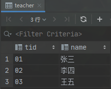
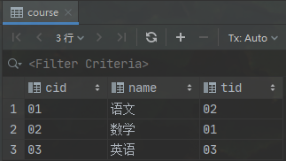
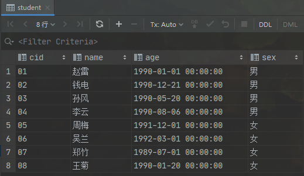
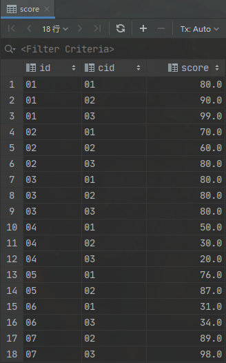

#  PRACTICE
   
---

* 查询01课程比02课程成绩高的学生的信息及课程分数。
      
       s
     
* 查询同时存在01课程和02课程的情况。
      
       s
       
* 查询存在01课程但可能不存在02课程的情况(不存在时显示为null)。
       
        s
       
* 查询不存在01课程但存在02课程的情况。
       
        s

* 查询平均成绩≥60分的同学的学生编号和学生姓名和平均成绩。
       
        s

*  查询在score表存在成绩的学生信息。
       
        s

* 查询所有同学的学生编号、学生姓名、选课总数、所有课程的总成绩(没成绩的显示为null)。
       
        s

* 查有成绩的学生信息。
       
        s

* 查询「李」姓老师的数量。
       
        s

*  查询学过「张三」老师授课的同学的信息。
       
        s

* 查询没有学全所有课程的同学的信息。
       
        s

* 查询至少有一门课与学号为01的同学所学相同的同学的信息。
       
        s

* 查询和01号的同学学习的课程完全相同的其他同学的信息。
       
        s

* 查询没学过「张三」老师讲授的任一门课程的学生姓名。
       
        s

* 查询两门及其以上不及格课程的同学的学号，姓名及其平均成绩。
       
        s

* 检索01课程分数＜60，按分数降序排列的学生信息。
      
       s

* 按平均成绩从高到低显示所有学生的所有课程的成绩以及平均成绩。
      
       s

* 查询各科成绩最高分、最低分和平均分。
      
       s
       
       
--- 
以如下形式显示：

    课程ID，课程name，最高分，最低分，平均分，及格率，中等率，优良率，优秀率
要求输出课程号和选修人数，查询结果按人数降序排列，若人数相同，按课程号升序排列

* 按各科成绩进行排序，并显示排名， score重复时保留名次空缺。
      
       s

* 按各科成绩进行排序，并显示排名， score重复时合并名次。
      
       s

* 查询学生的总成绩，并进行排名，总分重复时保留名次空缺。
      
       s

* 查询学生的总成绩，并进行排名，总分重复时不保留名次空缺。
      
       s

* 统计各科成绩各分数段人数：课程编号，课程名称，[100-85]，[85-70]，[70-60]，[60-0] 及所占百分比。
      
       s

*  查询各科成绩前三名。
      
       s

* 查询每门课程被选修的学生数。
      
       s

* 查询出只选修两门课程的学生学号和姓名。
      
       s

* 查询每门课程被选修的学生数。
      
       s

* 查询男生、女生人数。
      
       s

* 查询名字中含有「风」字的学生信息。
      
       s

* 查询同名同性学生名单，并统计同名人数。
      
       s

*  查询 1990 年出生的学生名单。
      
       s

* 查询每门课程的平均成绩，结果按平均成绩降序排列，平均成绩相同时，按课程编号升序排列。
      
       s

* 查询平均成绩≥ 85 的所有学生的学号、姓名和平均成绩。
      
       s

* 查询课程名称为「数学」，且分数低于 60 的学生姓名和分数。
      
       s

* 查询所有学生的课程及分数情况（存在学生没成绩，没选课的情况）。
      
       s

* 查询任何一门课程成绩在 70 分以上的姓名、课程名称和分数。
      
       s

* 查询不及格的课程
      
       s

* 查询课程编号为 01 且课程成绩在 80 分以上的学生的学号和姓名
      
       s

* 求每门课程的学生人数
      
       s

* 成绩不重复，查询选修「张三」老师所授课程的学生中，成绩最高的学生信息及其成绩
      
       s

* 成绩有重复的情况下，查询选修「张三」老师所授课程的学生中，成绩最高的学生信息及其成绩
      
       s

* 查询不同课程成绩相同的学生的学生编号、课程编号、学生成绩
      
       s

* 查询每门功成绩最好的前两名
      
       s

* 统计每门课程的学生选修人数（超过5人的课程才统计）
      
       s

* 检索至少选修两门课程的学生学号
      
       s

* 查询选修了全部课程的学生信息
      
       s

* 查询各学生的年龄，只按年份来算
      
       s

* 查询本周过生日的学生
      
       s

* 查询下月过生日的学生
      
       s

---   

    create table if not exists student
    (
        cid  varchar(10) comment '学生id',
        name nvarchar(10) comment '学生名称',
        age  datetime comment '学生年龄',
        sex  nvarchar(10) comment '学生性别'
    ) ENGINE = InnoDB
      DEFAULT CHARSET = utf8
        comment '学生表';
    
    insert into student
    values ('01', N'赵雷', '1990-01-01', N'男');
    insert into student
    values ('02', N'钱电', '1990-12-21', N'男');
    insert into student
    values ('03', N'孙风', '1990-05-20', N'男');
    insert into student
    values ('04', N'李云', '1990-08-06', N'男');
    insert into student
    values ('05', N'周梅', '1991-12-01', N'女');
    insert into student
    values ('06', N'吴兰', '1992-03-01', N'女');
    insert into student
    values ('07', N'郑竹', '1989-07-01', N'女');
    insert into student
    values ('08', N'王菊', '1990-01-20', N'女');
    
    
    create table if not exists course
    (
        cid  varchar(10) comment '课程id',
        name varchar(10) comment '课程名称',
        tid  varchar(10) comment '任课教师id'
    ) ENGINE = InnoDB
      DEFAULT CHARSET = utf8
        comment '课程表';
    
    insert into course
    values ('01', '语文', '02');
    insert into course
    values ('02', '数学', '01');
    insert into course
    values ('03', '英语', '03');
    
    create table if not exists teacher
    (
        tid  varchar(10) comment '教师id',
        name varchar(10) comment '教师名'
    ) ENGINE = InnoDB
      DEFAULT CHARSET = utf8
        comment '教师表';
    insert into teacher
    values ('01', '张三');
    insert into teacher
    values ('02', '李四');
    insert into teacher
    values ('03', '王五');
    
    create table if not exists score
    (
        id    varchar(10) comment '成绩id',
        cid   varchar(10) comment '课程id',
        score decimal(18, 1) comment '成绩'
    ) ENGINE = InnoDB
      DEFAULT CHARSET = utf8
        comment '成绩表';
    insert into score
    values ('01', '01', 80);
    insert into score
    values ('01', '02', 90);
    insert into score
    values ('01', '03', 99);
    insert into score
    values ('02', '01', 70);
    insert into score
    values ('02', '02', 60);
    insert into score
    values ('02', '03', 80);
    insert into score
    values ('03', '01', 80);
    insert into score
    values ('03', '02', 80);
    insert into score
    values ('03', '03', 80);
    insert into score
    values ('04', '01', 50);
    insert into score
    values ('04', '02', 30);
    insert into score
    values ('04', '03', 20);
    insert into score
    values ('05', '01', 76);
    insert into score
    values ('05', '02', 87);
    insert into score
    values ('06', '01', 31);
    insert into score
    values ('06', '03', 34);
    insert into score
    values ('07', '02', 89);
    insert into score
    values ('07', '03', 98);
    
