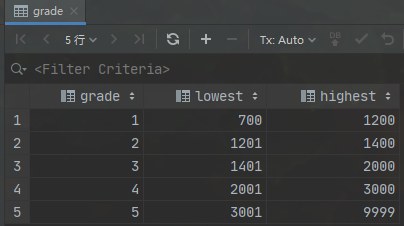
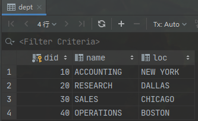
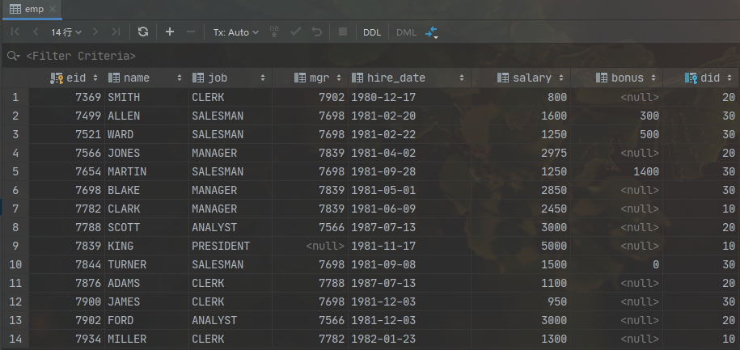

#  PRACTISE
   
---

* 查找部门30中员工的详细信息
      
       s
     
* 找出从事clerk工作的员工的编号、姓名、部门号。
      
       s
     
* 检索出奖金多于基本工资的员工信息。
      
       s

* 检索出奖金多于基本工资60%的员工信息。
      
       s

* 找出10部门的经理、20部门的职员 的员工信息。
      
       s

* 找出10部门的经理、20部门的职员 或者既不是经理也不是职员但是工资高于2000元的员工信息。
      
       s

* 找出获得奖金的员工的工作。
      
       s
 
* 找出奖金少于100或者没有获得奖金的员工的信息。
      
       s
 
* 找出姓名以A、B、S开始的员工信息。
      
       s
 
* 找到名字长度为6个字符的员工信息。
      
       s
 
* 名字中不包含R字符的员工信息。
      
       s
 
* 返回员工的详细信息并按姓名排序。
      
       s
 
* 返回员工的信息并按员工的工作年限降序排列。
      
       s
 
* 返回员工的信息并按工作名称降序工资升序排列。
      
       s
 
* 计算员工的日薪(按30天,奖金也分散到日常日薪中)。
      
       s
 
* 找出姓名中包含A的员工信息。
      
       s
 
* 返回所有员工的部门名、部门号。
      
       s

* 返回所有员工的部门名、部门号(dept,emp)。
      
       s

* 工资水平多于smith的员工信息。
      
       s

* 返回员工和所属经理的姓名（自连接）。
      
       s

* 返回雇员的雇佣日期早于其领导雇佣日期的员工及其领导姓名(在日期类型可以直接比较)。
      
       s

* 返回工资高于30部门所有员工工资水平的员工信息。
      
       s

* 返回部门号、部门名、部门所在位置及其每个部门的员工总数。
      
       s

* 返回员工的姓名、所在部门名及其工资。
      
       s

* 返回员工姓名及其所在的部门名称。
      
       s

* 返回从事clerk工作的员工姓名和所在部门名称。
      
       s

* 返回部门号,部门名称及其本部门的最低工资。
      
       s

* 返回销售部(sales)所有员工的姓名。
      
       s

* 返回工资多于平均工资的员工。
      
       s

* 返回与SCOTT从事相同工作的员工。
      
       s

* 返回与30部门员工工资水平相同的员工姓名与工资。
      
       s

* 返回员工的详细信息(包括部门名)。
      
       s

* 返回员工工作及其从事此工作的最低工资。
      
       s

* 返回不同部门经理的最低工资。
      
       s

* 计算出员工的年薪，并且以年薪排序。
      
       s

* 返回工资处于第四级别的员工的姓名。
      
       s

* 返回工资为二等级的职员名字、部门所在地、和二等级的最低工资和最高工资。
      
       s

---   

    CREATE TABLE IF NOT EXISTS dept
    (
        did  INT PRIMARY KEY comment '部门编号',
        name VARCHAR(14) comment '部门名称',
        loc  VARCHAR(13) comment '部门地址'
    ) ENGINE = InnoDB
      DEFAULT CHARSET = utf8
        comment '部门';
    
    INSERT INTO dept
    VALUES (10, 'ACCOUNTING', 'NEW YORK');
    INSERT INTO dept
    VALUES (20, 'RESEARCH', 'DALLAS');
    INSERT INTO dept
    VALUES (30, 'SALES', 'CHICAGO');
    INSERT INTO dept
    VALUES (40, 'OPERATIONS', 'BOSTON');
    
    CREATE TABLE IF NOT EXISTS emp
    (
        eid       INT PRIMARY KEY comment '员工编号',
        name      VARCHAR(10) comment '员工名称',
        job       VARCHAR(9) comment '工作',
        mgr       DOUBLE comment '直属领导编号',
        hire_date DATE comment '入职时间',
        salary    DOUBLE comment '工资',
        bonus     DOUBLE comment '奖金',
        did       INT comment '部门号',
        FOREIGN KEY (did) REFERENCES dept (did)
    ) ENGINE = InnoDB
      DEFAULT CHARSET = utf8
        comment '员工';
    
    INSERT INTO emp
    VALUES (7369, 'SMITH', 'CLERK', 7902, '1980-12-17', 800, NULL, 20);
    INSERT INTO emp
    VALUES (7499, 'ALLEN', 'SALESMAN', 7698, '1981-02-20', 1600, 300, 30);
    INSERT INTO emp
    VALUES (7521, 'WARD', 'SALESMAN', 7698, '1981-02-22', 1250, 500, 30);
    INSERT INTO emp
    VALUES (7566, 'JONES', 'MANAGER', 7839, '1981-04-02', 2975, NULL, 20);
    INSERT INTO emp
    VALUES (7654, 'MARTIN', 'SALESMAN', 7698, '1981-09-28', 1250, 1400, 30);
    INSERT INTO emp
    VALUES (7698, 'BLAKE', 'MANAGER', 7839, '1981-05-01', 2850, NULL, 30);
    INSERT INTO emp
    VALUES (7782, 'CLARK', 'MANAGER', 7839, '1981-06-09', 2450, NULL, 10);
    INSERT INTO emp
    VALUES (7788, 'SCOTT', 'ANALYST', 7566, '1987-07-13', 3000, NULL, 20);
    INSERT INTO emp
    VALUES (7839, 'KING', 'PRESIDENT', NULL, '1981-11-17', 5000, NULL, 10);
    INSERT INTO emp
    VALUES (7844, 'TURNER', 'SALESMAN', 7698, '1981-09-08', 1500, 0, 30);
    INSERT INTO emp
    VALUES (7876, 'ADAMS', 'CLERK', 7788, '1987-07-13', 1100, NULL, 20);
    INSERT INTO emp
    VALUES (7900, 'JAMES', 'CLERK', 7698, '1981-12-03', 950, NULL, 30);
    INSERT INTO emp
    VALUES (7902, 'FORD', 'ANALYST', 7566, '1981-12-03', 3000, NULL, 20);
    INSERT INTO emp
    VALUES (7934, 'MILLER', 'CLERK', 7782, '1982-01-23', 1300, NULL, 10);
    
    
    CREATE TABLE IF NOT EXISTS grade
    (
        grade   INT comment '工资等级',
        lowest  DOUBLE comment '最低工资',
        highest DOUBLE comment '最高工资'
    ) ENGINE = InnoDB
      DEFAULT CHARSET = utf8
        comment '工资等级';
    INSERT INTO grade
    VALUES (1, 700, 1200);
    INSERT INTO grade
    VALUES (2, 1201, 1400);
    INSERT INTO grade
    VALUES (3, 1401, 2000);
    INSERT INTO grade
    VALUES (4, 2001, 3000);
    INSERT INTO grade
    VALUES (5, 3001, 9999);
    
