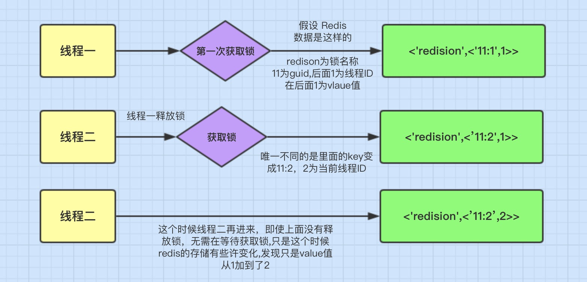

# Redis

---

KV内存数据库，加载在**内存**当中进行操作，定期通过**异步**操作把数据flush到硬盘上

## 数据类型

### String

* 单K最大容量0.5GB
* **底层**

        SDS（简单动态字符串）通过内存预分配和延迟释放空间来降低内存重分配频率
    * **结构**
        * `int len`：已使用字节数
        * `int free`：未使用字节数
        * `char buf[]`：字节数组
    * **优势**
        * 通过`内存预分配`和`延迟释放`来**降低内存重分配频率**
        * 可存取文本以外的格式
* **应用**
    * **分布式锁**：`SETEX`

### List

* **底层**
    * 3.2前
        * `ziplist`（不利于增删）：K小或K少时
        * **双向链表（内存占用大）**：K大或K多时
    * 3.1后
        * `quick list`
* **应用**
    * FIFO消息队列（`rpush`生产，`lpop`消费），但不支持**ACK**和**持久化**

### Set

* **底层**
    * **元素个数<512** `&&` **元素均为整数**：`inset`
    * **元素个数>511** `||` **元素不全为整数**：`hashtable`
* **应用**
    * 高性能的tag系统
    * 用户关注关系

### Hash

* **底层**
    * dictEntry：包含 两个 hashtable，通常情况下只有一个`hashtable`有值，扩容缩容时会渐进式rehash到新的`hashtable`，迁移完成后删掉旧的，创建一个新的空`hashtable`

### zSet

* **底层**
    * `zip list`
        * 条件：元素数<128 & 没有超过64byte的K或V
        * 结构：每个集合元素使用两个紧挨在一起的压缩列表节点来保存，第一个节点保存元素的成员，第二个元素保存元素的分值
    * dict（K=成员，V=score，用于按K取score，O(1)）+skip list（按分值排序，支持范围查询）
* **应用**
    * 排行榜
    * 延时器
    * GeoHash

### BloomFilter

* 基于bitmap
* **原理**
    1. **初始化**：生成一个长度为n的bitmap，每个bit为0
    2. **添加**：对K进行多次hash，将每个hash值对n取模后的下标bit置为1
    3. **判断**：对K进行多次hash，若某个hash值对n取模后的下标bit为0即为**不存在**
* **优缺点**：判断不存在的**一定不存在**，判断存在的**不一定存在**

### GeoHash

* **底层**：**zSet**，`vlaue`为元素，`score`为经纬度合并后的二进制编码
* **命令**
    * `geoadd K 经度1 维度1 k1 经度2 维度2 k2 ...`：向K中添加k1、k2、k3...
    * `geodist K k1 k2 单位`：获取K中k1和k2之间的距离，距离单位可自选
    * `geopos K k1`：获取K中k1经纬度
    * `geohash K k1`：获取K中k1经纬度的`base32`编码，结果可在[geohash.org](http://geohash.org)上观察
    * `georadiusbymember K k1 5 km withcoord withhash withdist count 3 desc`：获取K中k1周围5km内按距离倒序排列的前3个k及其距离，坐标，`base32`
        * `georadiusbymember K 经度 维度 5 km withcoord count 3 desc`：获取K中指定经纬度周围5km内按距离倒序排列的前3个k及其坐标

### Stream

    类似kafka的轻量级发布/订阅实现

### HyperLogLog

[UV统计](https://mp.weixin.qq.com/s/9dtGe3d_mbbxW5FpVPDNow)

## 持久化

* ***RDB***（默认）： 特定的间隔保存那个时间点的一个数据快照
    * 安全性较差
    * RDB文件大，恢复慢，磁盘IO多
* ***AOF***：追加操作日志
    * 安全，可将数据及时同步到文件中，恢复更完整
    * AOF文件大，恢复慢，磁盘IO多
    * 灵活。多种持久化频率：
        - `appendfsync always`：只要发生修改就写入到文件
        - `appendfsync everysec`：每秒写1次
        - `appendfsync no`：OS来自主决定写入时机
* ***RDB+AOF***：**AOF**文件中包含**AOF**和**RDB**两种格式的文件

### 数据恢复

**RDB**和**AOF**同时启用，**RDB**用来恢复绝大多数数据，**AOF**恢复**RDB**间隔期数据

## 事务

        只保证命令串行执行且全部执行，但失败时并不回滚而是继续执行，所以redis不能保证原子性（lua可保证）

* ***Multi***：开启事务
* ***Exec***：执行事务内容
* ***Discard***：取消事务
* ***Watch***：监视K，若事务执行前K有改动，中断事务

## 清除K

- **被动**：读、写过期K时会删除此K
- **主动**：定期或超过`max memory`时淘汰以下：
    - **不淘汰（`no-enviction`）**：**默认**，再写会报错
    - 作用于**全量**的3种（这3种状态下即使未设置过期时间也会删除）：
        - **最近最少使用（`allkeys-lru`）**
        - **随机（`allkeys-random`）**
        - **最不常用（`allkeys-lfu`）**
    - 作用于 **已设置过期时间的数据集（server.db[i].expires）** 的：
        - **最近最少使用（`volatile-lru`）**
        - **随机（`volatile-random`）**
        - **最不常用（`volatile-lfu`）**
        - **最小有效期（`volatile-ttl`）**

## 缓存风险

|     |       穿透       |       击穿       |      雪崩       |
|:----|:--------------:|:--------------:|:-------------:|
| 定义  |      都不存在      | 缓存没、MySQL有的少数K |    缓存大量过期     |
| 方案A |      接口鉴权      |   禁止热点key过期    |    禁止热点K过期    |
| 方案B | 布隆过滤器过滤一定不存在的K |    同步逻辑加互斥锁    |   添加过期时间偏移    |
| 方案C | 对不存在的数据缓存为NULL |                | 设置过期时间更长的二级缓存 |

### 缓存与DB一致性

- 延时双删
  
- MQ
  

## 分布式锁

* ***SETEX***:成功返回1，已存在返回0
* ***Redisson***：可重入，提高效率
    * **lua**：redis命令脚本，使得多个命令形成原子性
    * **缺点**：主从切换时可能导致多个客户端同时加锁

[Redisson](https://mp.weixin.qq.com/s/CbnPRfvq4m1sqo2uKI6qQw)
[Redis + Lua实现限流](https://mp.weixin.qq.com/s/kyFAWH3mVNJvurQDt4vchA)

---

## 集群

### 主从

### 哈希槽

    集群有`16384`个哈希槽，根据节点数量大致均等的将哈希槽映射到不同的节点（所以集群节点数<=16384），每个key通过`CRC16`校验后对16384取模来决定放置哪个槽。

    便于动态增删节点（哈希槽与节点的归属关系会重新分配），提高可用性

### 同步

* 初次同步：从节点会从主节点的RDB做一次全量复制，并同时将后续修改操作记录到内存buffer，复制节点接受完成后将RDB镜像加载到内存。加载完成后，再通知主节点将期间修改的操作记录同步到复制节点进行重放就完成了同步过程
* 增量同步：通过AOF日志同步即可，类似数据库的binlog

### 倾斜

对hot key加前缀使其散列位置变化

### 主从复制

https://blog.csdn.net/weixin_39890327/article/details/111615513

* 主不做持久化
* 从库可按需设置为更新完毕前阻塞

---

## 性能

### 单线程模型

基于 `Reactor` 模式的文件事件处理器是单线程运行。通过`IO多路复用`来监听客户端连接及请求

### 多线程

- **4.0**为实现`UNLINK`、`FLUSHALL ASYNC`、`FLUSHDB ASYNC`非阻塞删除引入多线程
- **6.0** 为了提高网络 IO 读写性能引入多线程，默认禁用

### 单线程优势

- 单线程编程容易并且更容易维护；
- 性能瓶颈不在**CPU**，主要在**内存**和**网络**；
- 多线程就会存在**死锁**、**线程上下文切换**等问题，甚至会影响性能。
