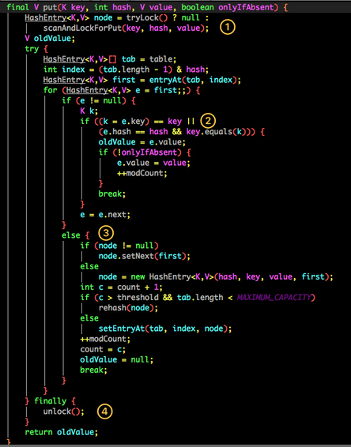

# 数据结构

---

## 基本数据类型

|             | bit |      min（-2^(bit-1)）       |     max（2^(bit-1)-1）      | default  |
|:------------|:---:|:--------------------------:|:-------------------------:|:--------:|
| **byte**    |  8  |       -128=-2^(8-1)        |       127=2^(8-1)-1       |    0     |
| **short**   | 16  |           -32768           |           32767           |    0     |
| **int**     | 32  |       -2,147,483,648       |       2,147,483,647       |    0     |
| **long**    | 64  | -9,223,372,036,854,775,808 | 9,223,372,036,854,775,807 |    0L    |
| **float**   | 32  |            x=7             |             0             |   0.0f   |
| **double**  | 64  |            x=7             |             0             |   0.0d   |
| **char**    | 16  |         \u0000（0）          |       \uffff（65535）       | ''（等同于0） |
| **boolean** |  1  |           false            |           true            |  false   |

## String

#### 不可变？

1. 无修改自身值的方法
2. value被**private**、**final**、**@Stable**修饰

   > ```java
    > public final class String implements Serializable, Comparable<String>, CharSequence {
    >     @Stable //变量只能被赋非默认值一次
    >     private final byte[] value;
    > }
    > 
    > abstract class AbstractStringBuilder implements Appendable, CharSequence {
    >     byte[] value;
    > }
    >```

#### 在JDK9新增的底层变化

> JDK9开始默认使用`Latin-1`编码（此编码下，`byte`占用1B，`char`占用2B），如果有`Latin-1`表示不了的字符则使用范围的则拓展为`UTF-16`编码。

#### 为甚循环拼接字符串不用String？

> String对象的`+=`是通过生成StringBuilder对象再调用`append()`实现的，循环调用会不断构建StringBuilder

#### 重写equals和hashcode

> `hash()`结果相同时才会通过`equals()`确定对象是否一致（`equals()`是对象是否一致的充要条件，所以可以通过重写对象的`equals()`来自定义**对象相同**的标准）如果只修改`equals()`不修改`hash()`，会误将预期相同的对象判断为不同。比如对象作为key插入map时，两个对象可能因hashcode不相同而定位到不同的entry/node，造成无法覆盖，违反map的唯一性

## Tree

|       |      [红黑树](https://mp.weixin.qq.com/s/-8JFh5iLr88XA4AJ9mMf6g)       |   B树    |       B+树       |                       BST树（二叉查找树）                        |
|:------|:-------------------------------------------------------------------:|:-------:|:---------------:|:--------------------------------------------------------:|
| 特点    | ①值存在红节点<br/>②根节点和叶节点是黑<br/>③红节点的2个子节点是黑<br/>④节点到它的叶节点的所有路径中的黑节点个数相同 |         |     数据只在叶节点     | ①左子树上所有节点的值≤根结点的值<br/>②右子树上所有节点的值均≥根结点的值<br/>③左、右子树都是BST |
| 优     |                             近似平衡（增删简单）                              |         | 层级少、查询稳定、适合排序分组 ||
| 劣     |                                树比较高                                 |         |                 |                      可能左右**极度**不平衡                       |
| 应用    |                    TreeMap、TreeSet、HashMap（JDK8）                    |         |    InnoDB索引     |                                                          |
| 时间复杂度 |                              查增删O(lgn)                              | 查O(lgn) |     查O(lgn)     |                                                          |

## Collection


### List

|                  |      ArrayList       |   LinkedList    | Vector |
|:-----------------|:--------------------:|:---------------:|:------:|
| **底层**           |          数组          |      双向链表       |   数组   |
| **线程安全**         |          ×           |        ×        |   √    |
| **占用内存**         |          小           | 大（**作者自称从来不用**） |   小    |
| **初始容量**         | 空，**初次添加元素时**设置容量为10 |        0        |   10   |
| **扩容比例**         |        1.5倍+1        |       不扩容       |   2    |
| **RandomAccess** |          √           |        ×        |        |
| `get(int)`       |         O(1)         |      O(n)       |        |
| `add(E)`         |         O(1)         |      O(1)       |        |
| `add(index,E)`   |         O(n)         |      O(n)       |        |
| `remove(int)`    |          ？           |        ？        |        |
| `remove(E)`      |          ？           |        ？        |        |

### 并发安全List

|        | CopyOnWriteArrayList | Collections.synchronizedList() | Vector | 
|:-------|:--------------------:|:------------------------------:|:------:|
| **读**  | 存储数据的数组是`volatile`的  |             同步代码块              |  同步方法  |     
| **写**  | 加锁→**拷贝**→修改→重定向→解锁  |             同步代码块              |  同步方法  |       
| **场景** |         读多写少         |              读少写多              |  不推荐   |      

**读**：存储数据的数组是`volatile`的

**写**：加锁→**拷贝**→修改→重定向→解锁

### Queue与Deque

|                  |  `Queue`   |     `Deque`     |
|:-----------------|:----------:|:---------------:|
| **插入头(失败报错)**    |  add(E e)  |  addLast(E e)   |
| **插入尾(失败返回特殊值)** | offer(E e) | offerLast(E e)  |
| **插入头(失败异常)**    |     无      |  addFirst(E e)  |
| **插入头(失败返回特殊值)** |     无      | offerFirst(E e) |
| **删除头(失败报错)**    |  remove()  |  removeFirst()  |
| **删除头(失败返回特殊值)** |   poll()   |   pollFirst()   |
| **删除尾(失败报错)**    |     无      |  removeLast()   |
| **删除尾(失败返回特殊值)** |     无      |   pollLast()    |
| **获取头(失败报错)**    | element()  |   getFirst()    |
| **获取头(失败返回特殊值)** |   peek()   |   peekFirst()   |
| **获取尾(失败报错)**    |     无      |    getLast()    |
| **获取尾(失败返回特殊值)** |     无      |   peekLast()    |

### Set

|       | HashSet | LinkedHashSet |  TreeSet  |
|:------|:-------:|:-------------:|:---------:|
| 底层    | HashMap | LinkedHashMap |    红黑树    |
| 线程安全  |    ×    |       ×       |     ×     |
| 排序方式  |    无    |     链表顺序      | 自然顺序，可自定义 |
| null值 |    √    |       ×       |     ×     |

---

## Map

|       |      HashMap       | HashTable  |  TreeMap  |   LinkedHashMap    |          ConcurrentHashMap          |
|:------|:------------------:|:----------:|:---------:|:------------------:|:-----------------------------------:|
| 底层    | 数组下挂**链表**或**红黑树** |   数组下挂链表   |    红黑树    | HashMap+LinkedList | Node<K,V> implements Map.Entry<K,V> |
| 线程安全  |         ×          |     √      |     ×     |         ×          |                  √                  |
| 有序    |         ×          |     ×      | 自然顺序，可自定义 |         √          |                  ×                  |
| null键 |         √          |     ×      |     ×     |         √          |                  ×                  |
| null值 |         √          |     ×      |     ×     |         √          |                  ×                  |
| 初始容量  |         16         |     11     |     0     |         16         |                 16                  |
| 扩容    |         翻倍         |    翻倍+1    |           |         翻倍         |                                     |

### HashMap

#### 遍历

|                           | 速度（越小越快） | 线程安全 | 
|:--------------------------|:--------:|:----:|
| Streams API**多线程**遍历      |    0     |  ×   |   
| **迭代器** 遍历`EntrySet`      |    1     |  √   |
| **ForEach** 遍历 `EntrySet` |    1     |  ×   |
| Streams API**单线程**遍历      |    2     |  ×   |
| **迭代器** 遍历`KeySet`        |    3     |  √   |
| **ForEach** 遍历 `KeySet`   |    3     |  ×   |    
| **Lambda** 遍历             |    4     |  ×   |

- 遍历 `KeySet`比遍历遍历 `EntrySet`慢？
  > `keys()`本身也需要遍历一次map

- 为什么会并发修改异常？

  > 在迭代器遍历期间如果集合内容发生变化，就会改变`modCount`的值。执行`hasNext()`/`next()`之前会检测`modCount`变量是否为预期值，是的话继续遍历，否则抛出**并发修改异常**并终止

#### 扩容

- 时机
  > 元素数量≥`Capacity`*`LoadFactor`时

* 过程
  > 创建一个长度是原数组的2倍的新数组，把原数组所有的Entry（Node）重新Hash到新数组
* 为什么不直接复制到新数组？
  > 哈希公式：index = HashCode（Key） & （Length - 1），length值变了
* `Capacity`为什么是2的幂？
  > 对于整数x有，x % 2ⁿ =x & (2ⁿ-1)，位运算(&)要比取模(%)快
* `Capacity`默认为什么是16？
  > 16相对通用
* 什么时候链表转红黑树？
  > **插入之后** && **map.size()＞63** && **某链表长度＞7** 
* 什么时候红黑树转链表？
  > resize()时树节点数量＜7
* 为什么超过8才用红黑树？
  > 红黑树需要性能维持平衡，数量少的时候线性表快且内存开销小
* 为什么用红黑树而不用B树、BST？
  > 红黑树近似平衡，允许局部不平衡，所以性能高，BST特殊情况下回变成线性，与链表效率相同`O(n)`

#### Put


#### 不安全

- **[链表成环](https://zhuanlan.zhihu.com/p/338892611)（1.7）**：头插法扩容时会翻转旧数组的顺序

- **数据覆盖**：如果线程A、B同时`put()`，且2个key的hash值**恰好**相同且定位到的Node为`NULL`，所以这线程A、B都会开始插入。若线程A进入后还未进行数据插入时挂起，而线程B正常执行插入数据，然后线程A获取CPU时间片，此时线程A不用再进行hash判断了，会把线程B插入的数据给覆盖

### ConcurrentHashMap

#### null

> 试想一下，当我们首先从map中get某个key，由于map中这个key不存在，那么会返回null，这之后我们通过contains进行判断，此时如果有线程并发写入了一条value为null的值，那么contains的结果就为true。这样就会与真实的情况不一致了，这就是二义性。

#### 结构

* 7

  
    * ConcurrentHashMap主要成员变量：
        * `final Segment<K,V>[] segments`
        * `transient Set<K> keySet`
        * `transient Set<Map.Entry<K,V>> entrySet`
        * Segment主要成员变量：
            * `transient volatile HashEntry<K,V>[] table`
            * `transient int count`
            * `transient int modCount`
            * `transient int threshold`
            * `final float loadFactor`

* 8

  

#### 线程安全put

* 7

  分段锁：`Segment`继承于`ReentrantLock`，并发度=`Segment`个数，每当一个线程占用锁访问一个`Segment`时，不会影响到其他的`Segment`。

* PUT如何保证线程安全？

  
    1. 尝试自旋获取锁
    2. 如果重试的次数达到了`MAX_SCAN_RETRIES`则改为SYN获取保证能获取成功

  
    1. hash定位并取得Segment，将当前Segment中的 table 通过 key 的 hashcode 定位到 HashEntry。
    2. 遍历该HashEntry，如果不为空则判断传入的 key 和当前遍历的 key 是否相等，相等则覆盖旧的value
    3. 为空则新建一个 HashEntry 并加入到 Segment 中，同时会判断是否需要扩容
    4. 释放当前Segment的锁
* 8
    * 锁升级（CAS + synchronized）
      

#### 线程安全get

    volatile保证了实时性，无锁所以高效
