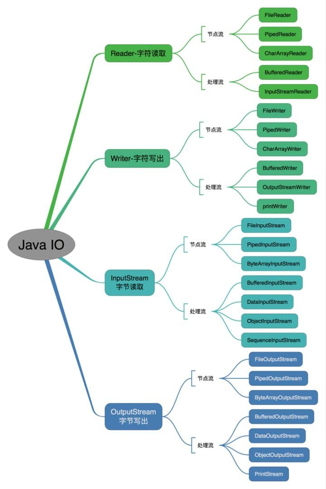
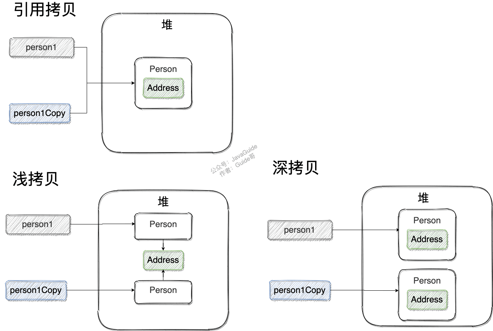
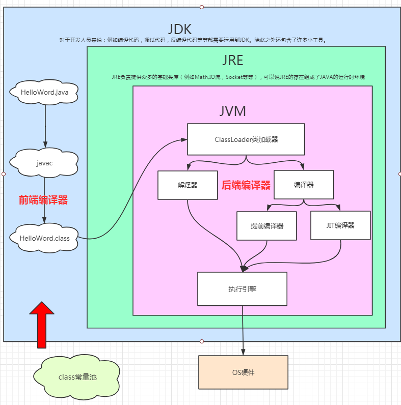
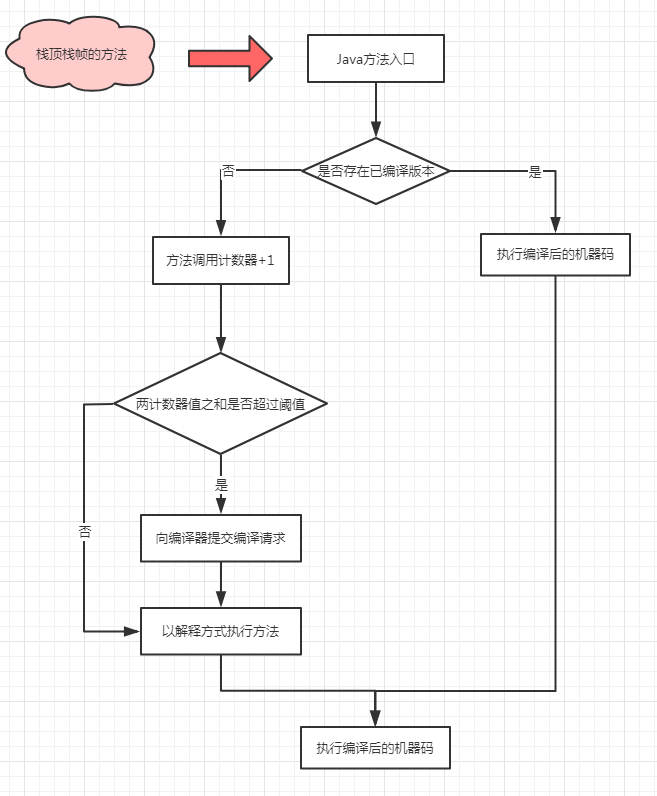
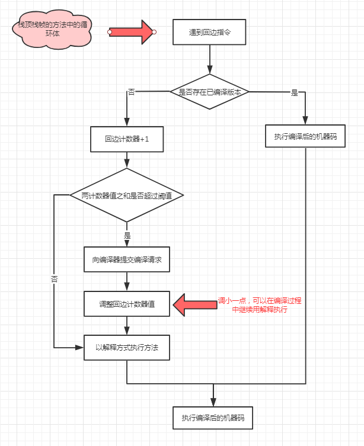

# Java

---
## IO

---
## 数据类型

| 基本类型      | 位数  | 字节  | 默认值     | 取值范围                                       |
|:----------|:----|:----|:--------|--------------------------------------------|
| `byte`    | 8   | 1   | 0       | -128 ~ 127                                 |
| `short`   | 16  | 2   | 0       | -32768 ~ 32767                             |
| `char`    | 16  | 2   | 'u0000' | 0 ~ 65535                                  |
| `int`     | 32  | 4   | 0       | -2147483648 ~ 2147483647                   |
| `float`   | 32  | 4   | 0f      | 1.4E-45 ~ 3.4028235E38                     |
| `long`    | 64  | 8   | 0L      | -9223372036854775808 ~ 9223372036854775807 |
| `double`  | 64  | 8   | 0d      | 4.9E-324 ~ 1.7976931348623157E308          |
| `boolean` | 1   |     | false   | true、false                                 |

## 深、浅、引用拷贝

## JIT（即时编译）

- 解释执行：执行时解释器将代码逐条翻译成机器码，不做保存，好似吃涮锅，吃一口再涮一口
    - 可立即运行
    - 节约内存
    - 作为JIT编译的回退路线（例如如果加载了新类，类的继承结构就会变化，出现”罕见陷阱”。此时可以通过逆优化，让编译执行的代码重新进行解释执行）
- 编译执行：编译器将代码编译成机器码后保存，运行保存的机器码。好似吃酒席，上齐了菜再开吃

对于高频执行的代码，部分JVM如Hotspot将其编译成机器码，使得其执行速度加快

当今的主流JVM都同时包含解释器和编译器

Hotspot中包含2个C++实现的JIT compiler

- C1（客户端编译器）: 对字节码进行简单优化后进行编译
- C2（服务器编译器）：对字节码进行深度优化，需耗费一定时间进行编译，编译结果优化程度较高

- lvl 0：interpreter解释执行
- lvl 1：C1编译，无profiling(性能监控功能)
- lvl 2：C1编译，仅方法及循环back-edge执行次数的profiling((性能监控功能))
- lvl 3：C1编译，除lvl 2中的profiling外还包括branch（针对分支跳转字节码）及receiver type（针对成员方法调用或类检测，如checkcast，instnaceof，aastore字节码）的profiling
- lvl 4：C2编译

1、通常情况下，一个方法先被解释执行（lvl 0），然后被C1编译（lvl 3），再然后被得到profile数据的C2编译（lvl 4）
2、如果编译对象非常简单，虚拟机认为通过C1编译或通过C2编译并无区别，便会直接由C1编译且不插入profiling代码（lvl 1）
3、在C1忙碌的情况下，interpreter会触发profiling，而后方法会直接被C2编译；
4、在C2忙碌的情况下，方法则会先由C1编译并保持较少的profiling（lvl 2），以获取较高的执行效率（与3级相比高30%）。

通常情况下，C2 代码的执行效率要比 C1 代码的高出 30% 以上。然而，对于 C1 代码的三种状态，按执行效率从高至低则是 1 层 > 2 层 > 3 层。

其中 1 层的性能比 2 层的稍微高一些，而 2 层的性能又比 3 层高出 30%。这是因为 profiling 越多，其额外的性能开销越大。

实施分层编译后，解释器、客户端编译器和服务端编译器就会同时工作，热点代码都可能会被多次编译，用客户端编译器获取更高的编译速度，用服务端编译器获取更好的编译质量，在解释执行的时候也无须额外承担收集性能监控信息的任务，而在服务端编译著采用高复杂度的优化算法时，客户端编译器可先采用简单优化来为它争取更多的编译时间。

---

## 热点代码

1. 被多次调用的方法

2. 被多次执行的循环体

要知道某段代码是不是热点代码，是不是需要触发即时编译，这个行为被称为“热点探测”（Hot Spot Code Detection），目前主流的有两种方式：

1. 基于采样的热点探测（Sample Based Hot Spot Code Detection）：周期性地检查各个线程的调用栈顶，如果发现某个（或者某些）方法经常出现在栈顶（栈顶的方法是正在被执行的方法），那这个方法就是“热点方法”。好处是高效，而且很容易获取方法调用的关系（将调用栈展开即可）。缺点是不够精确，容易受到线程阻塞和外部因素影响。

2. 基于计数器的热点探测（Counter Based Hot Spot Code Detection）：为每个方法（甚至代码块）建立计数器，统计方法的执行次数，如果执行次数超过一定的阙值就认为是“热点方法”。缺点是比较麻烦，需要为每个方法维护计数器，而且不能直接获得调用关系。优点是更加严谨准确。

### 方法调用计数器

热度衰半

当超过一定的时间限度，如果方法的调用次数仍然不足以让它提交给即时编译器，那该方法的调用计数器就会被减半

可以使用虚拟机参数-XX:-UseCounterDecay来关闭热度衰减。另外还可以使用-XX:CounterHalfLifeTime参数设置半衰周期的时间，单位是秒。

### 回边计数器

当一个解释器遇到一条回边指令时，会先检查该执行代码片段是否存在被即时编译过的版本，如果存在，则优先使用编译后的本地代码执行。如果不存在已被编译过版本，则将回边计数器值加一，然后判断方法调用计数器与回边计数器值之和是否超过方法调用计数器的阙值。如果超过阙值，将会提交一个栈上替换编译请求，并且把回边计数器的值稍微降低一些，以便继续在解释器中执行循环，等待编译器输出编译结果

