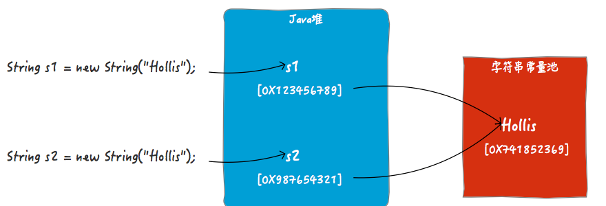
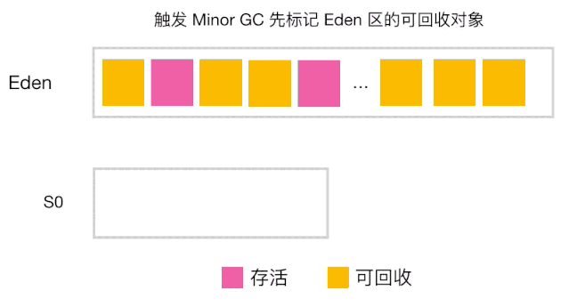

# JVM

---

## 构成

* ***程序计数器***：线程私有，使线程在CPU切换后能够恢复在切换之前的程序执行位置，**不溢出**
* ***栈***
    * ***JVM栈***：线程私有，会StackOverflow。生命周期与线程相同。每个方法被执行时会创建一个栈帧用于存储`局部变量表`、`操作数栈`、`方法返回地址`
      等信息。、方法执行完成、对应着它的栈帧在虚拟机栈中从入栈到出栈的过程
    * ***native栈***：仅为本地方法服务
* ***堆***（***HEAP***）：存放绝大部分对象，线程共享，会发生OOM
* ***方法区***（***永久代***、***PermGen***）：8之前存在，线程共享，存放`字符串常量`、`静态变量`等，动态类加载导致方法区可能OOM，只有FullGC
    * 
    * 
* ***元空间***（***Metaspace***）：直接分配在系统内存中

---

## 类加载

> 将.class加载为内存中的Class对象，若两个类相同,其所用的加载器是同一个

### 种类

* ***Bootstrap***：%JAVA_HOME%\lib下的`.class`和`.jar`，或`-Xbootclasspath`指定路径下的类，仅支持`.class`
* ***Extension***：%JAVA_HOME%\lib\ext下的`.class`和`.jar`，或被java.ext.dirs指定的`.class`
* ***Application***：ClassPath中的`.class`和`.jar`

### 双亲委派

* 原理：每个加载器都将请求委派给自己的父加载器，如果父类加载器无法加载（该加载器的搜索范围中没有找到对应的类）会退回给子加载器
* 目的：避免重复加载，防止用同全限定类名篡改基类
* 绕过
    * 自定义类加载器 ，重写`loadClass()`，如`Tomcat`里`StandardClassLoader`加载容器组件，每个项目的各对应一个`WebappClassLoader`，未打破此机制
    * 自定义类加载器 ，重写`findClass()`，打破此机制
    * SPI

### 类生命周期

1. ***加载***

    1. 通过一个类的全限定名来获取定义此类的二进制字节流（`.class`、网络、动态生成、数据库）
    2. 将字节流所代表的静态存储结构转化为方法区的运行时数据结构
    3. 在内存中生成一个代表这个类的java.lang.Class对象，作为方法区这个类的各种数据的访问入口

2. ***验证***

    1. ***文件格式***：验证字节流是否符合Class文件格式的规范（是否以魔术0xCAFEBABE开头？主次版本号是否在当前虚拟机的处理范围之内？常量池中的常量是否有不被支持的类型？）
    2. ***元数据***：分析语义保证其描述的信息符合Java语言规范的要求
    3. ***字节码***：通过数据流和控制流分析，确定程序语义是合法的、符合逻辑的
    4. ***符号引用***：确保解析动作能正确执行

3. ***准备***：设置static变量类型对应的默认值，比如`static int value=233`在准备阶段value=0而不是233（初始化阶段才会复制，若额外被final修饰，则为233）
4. ***解析***：常量池内的符号引用替换为直接引用
5. ***初始化***
    * 时机
        * new
        * 初始化静态字段
        * 调用静态方法
        * 反射
        * 子类初始化
    * 顺序
        * 初始化静态字段
        * 调用静态方法
        * 反射
6. ***使用***
7. ***卸载***

---

## 对象

* ***对象头***
    * **Mark Word**：存储对象的`HashCode`、分代年龄、锁标志位信息
    * **Klass Point**：指向它的类实例
* ***实例数据***：存放类的数据信息，父类的信息
* ***填充***：JVM为了使对象起始地址必须是8bytes的整数倍而对其进行的填充

---

## GC

### 分类

- 局部GC
    - `Minor GC`：发生在Eden的GC
    - `Young GC` : 发生在新生代（Eden、survivor0、survivor1）的GC
    - `Major GC`（`Old GC`）：老年代GC
    - `Mixed GC` : 同时回收整个新生代和部分老年代的GC
- 全局GC
    - `Full GC` ：回收整个堆和方法区的GC

### 发生区域

* 堆
* Metaspace（8以前：PermGen）

### 标记算法

* ***引用计数法***：
    * 缺点：无法处理循环引用
* ***可达性分析算法***：从`GC Roots`按引用向下关联，未被关联到的对象可回收

### GC Roots

* JVM栈中引用的对象（自定义变量）
* 类静态属性引用的对象（静态对象）
* 常量引用的对象
* Native方法引用的对象

### 引用

    不可达对象执行finalize()后若仍不可达才会被回收，若可达则本次不回收

* ***强引用***：绝对不会被回收，如`A a = new A()`
* ***软引用***：即将OOM之前会回收，回收之后内存依然不够才会OOM
* ***弱引用***：定义为软引用的对象会在下次GC时回收
* ***虚引用***：更弱的一种，可作为GC发生信号

### GC算法

* ***标记清除***：先标记，再回收
    * 缺点：内存碎片化严重，大对象因无连续空间存放会触发下一次GC
* ***复制***：内存均分为`主区`和`备区`，GC时将`主区`存活的对象复制到`备区`，然后回收`主区`全部内存，主备互换
    * 缺点：内存利用率最多50%
* ***标记整理***：先标记，然后移动至内存一端，再回收边界值以外全部对象
    * 缺点：频繁移动对象（这个移动是复制吗？）

### 分代

* ***新生代***：按照`8:1:1`的比例分为`Eden`、`Survivor0`、`Survivor1`，绝大部分对象在`Eden`中初始化

  
  

1. 将`Eden`中存活的对象复制到`Survivor0`，清空`Eden`

   
2. 若`Survivor0`满，将`Eden`和`Survivor0`中存活的对象复制到`Survivor1`（`Survivor1`放不下则把它们放到***老年代***），然后清空`Eden`和`Survivor0`，将`Survivor0`和`Survivor1`角色对调

   

* ***老年代***：GC类型为Full GC(Major GC)，***标记整理***
    * 动态晋升：对每个年龄段的对象大小求和，按年龄从小到大对和进行累加，当加入某年龄的和后大于`TargetSurvivorRatio`*`survivor_capacity`时，此年龄及更高年龄晋升
    * 在新生代中熬过N次（默认N=15，可配置）回收后仍然存活的对象，晋升到年老代
      

### 发生时机

* Full GC：
    * `老年代`占用达到设定值
    * System.gc()
* Minor GC：
    * `Eden`满

### [GC收集器](https://mp.weixin.qq.com/s/_AKQs-xXDHlk84HbwKUzOw)

#### 比较

|                   | 作用位置 |    算法    |     优点     |    缺点     |
|:------------------|:----:|:--------:|:----------:|:---------:|
| Serial            |  新   |    复制    |  适合client  | 单线程、STW、慢 |
| Serial Old        |  老   |  标记-整理   |  适合client  |           |
| ParNew            |  新   |    复制    | 多线程版Serial |           |
| Parallel Old      |  老   |  标记-整理   |            |           |
| Parallel Scavenge |  新   |    复制    |  效率高、8默认   |           |
| CMS               |  新   |  标记-清除   |   STW时间短   |   内存碎片化   |
| G1                | 新、老  | 标记-整理、复制 |   好、11默认   |           |

#### CMS

1. **初始标记**：仅标记`GC Roots`能直接关联到的对象，**STW**
2. **并发标记**：`GC Roots`向下搜索，与用户线程并行
3. **重新标记**：修正***并发标记***期间因用户线程运作而导致标记产生变动的那一部分对象的标记状态，**STW**
4. **并发清除**：与用户线程并行

#### G1

    11默认，把内存划分成最多2048个Region，每个Region会被标记为Eden、Survivor、Old中的一个

* ***分代***
    * **新生代**：默认占堆的5%（-XX:G1NewSizePercent=5），JVM会随时调整，最多为-XX:G1MaxNewSizePercent=60
    * **巨人代**：对象超过`Region`一半的大小会被放在这里
* ***适用场景***：长时间运行（理论上无内存碎片），STW有要求（可配置STW期望值）
* ***缺点***：维护各种Region的属性映射，分配需要内存开销
* ***过程***
    1. **初始标记**：仅标记`GC Roots`能直接关联到的对象，**STW**
    2. **并发标记**：`GC Roots`向下搜索，与用户线程并行
    3. **重新标记**：修正***并发标记***期间因用户线程运作而导致标记产生变动的那一部分对象的标记状态，**STW**
    4. **筛选回收**：根据可配置的参数进行可调节的回收，单次回收数量（内存块数量）取决于垃圾数量与用户预期时间。整体上是***标记整理***，局部上是***复制***，STW

#### ZGC

## 调优

### 目的

    减少STW，提高执行效率

### 参数与工具

|                  |             含义             |    默认值    |          示例          |
|:-----------------|:--------------------------:|:---------:|:--------------------:|
| Xms              |            堆最小值            | 物理内存的1/64 |       `-Xms2G`       |
| Xmx              |            堆最大值            | 物理内存的1/4  |       `-Xmx5G`       |
| NewSize          |           新生代最小值           |           |  `-XX:NewSize=32m`   |
| MaxNewSize       |           新生代最大值           |           | `-XX:MaxNewSize=64m` |
| Xmn              |           新生代固定            |           |      `-Xmn64m`       |
| NewRatio         |          新生代:老年代           |           |   `-XX:NewRatio=1`   |
| NewRatio         |          新生代:老年代           |           |   `-XX:NewRatio=1`   |
| MetaspaceSize    | Metaspace扩容时触发FullGC的初始化阈值 |  约20.8MB  |                      |
| MaxMetaspaceSize |     Metaspace动态分配的上限大小     |           |                      |

* melody+mat
* [Arthas](https://arthas.aliyun.com/doc/advanced-use.html)

### 思路

- 调整最大堆内存和最小堆内存
- 调整新生代和老年代的比值
- 调整Survivor区和Eden区的比值
- 设置原始类型的快速优化
- 改善锁机制性能：-XX:+UseBiasedLocking
- ……

### 实战

https://javaguide.cn/java/jvm/jvm-parameters-intro.html#_3-1-%E5%9E%83%E5%9C%BE%E5%9B%9E%E6%94%B6%E5%99%A8