# Spring

https://mp.weixin.qq.com/s/wcK2qsZxKDJTLIGqEIyaNg

---

### 设计模式

* ***工厂***：`BeanFactory`/`ApplicationContext`
* ***代理***：AOP的`CgLib`
* ***单例***：`Bean`，通过`ConcurrentHashMap`实现
* ***模板***：`jdbcTemplate`
* ***适配器***：AOP的`Advice`/MVC的`controller`

### `@Component`和`@Bean`

|     |          @Component          |    @Bean    |
|:----|:----------------------------:|:-----------:|
| 作用域 |              类               |     方法      |
| 用途  | 通过类路径扫描来自动侦测以及自动装配到Spring容器中 | 这是创建bean的方法 |

### `@Resource`和`@Autowired`

|      |                                                                                                                                                 `@Resource`                                                                                                                                                  |         `@Autowired`          |
|:-----|:------------------------------------------------------------------------------------------------------------------------------------------------------------------------------------------------------------------------------------------------------------------------------------------------------------:|:-----------------------------:|
| 源自   |                                                                                                                                                JSR（Java规范提案）                                                                                                                                                 |            Spring             |
| 注入方式 | [总结](https://blog.csdn.net/ljcgit/article/details/115353149) <br/>①不指定`name`或`type`时，字段名称的`bean`或者`BeanDefinition`存在?`byName`:`byType`;<br/>②只指定了`type`属性时，只有不存在与值对应的`bean`或`BeanDefinition`，才会通过`byType`找到唯一的一个类型匹配的bean；<br/>③只指定了`name`，执行`getBean()`获取；<br/>④同时指定`name`和`type`，先根据`name`查找并判断`type`是否一致。 | `byType`,结合`@Qualifier`可匹配到名字 |

### IOC初始化流程

1. ***定位***：获取配置文件路径
2. ***加载***：把配置转为`BeanDefinition`
3. ***注册***：存储`BeanDefinition`
4. ***实例化***：根据`BeanDefinition`创建实例

### IOC注入方式

1. ***构造方法***
2. ***setter()***
3. ***注解***

### 过滤器和拦截器

|          |    过滤器    |    拦截器    |
|:---------|:---------:|:---------:|
| 属于       | Servlet容器 | SpringMVC |
| 原理       |   函数回调    |    AOP    |
| 生效时机     | Servlet外  | Servlet内  |
| 能否读取Bean |     ×     |     √     |

### Bean作用域

* **单例**：在类中定义一个ThreadLocal成员变量可保证线程安全
* **多例**：每次请求都会创建1个bean实例
* **request**：每次http request新建1个生命周期同当前request的bean实例
* **session**：每个http session新建1个生命周期同当前session的bean实例
* **~~global-session~~**（5已弃用）

### Bean生命周期

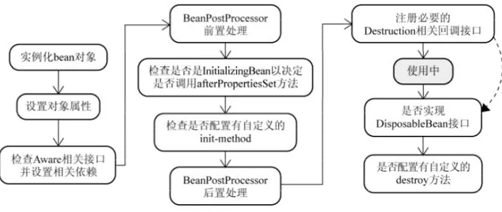
---

## AOP

基于动态代理实现，区别于静态代理（代理类由开发者创建，委托和代理通常一一对应，且增强方法冗余）

### 概念

* ***Pointcut***：通用方法，可指向到注解
* ***JoinPoint***：需要被环绕的对象
* ***Advice***：环绕方式
    * Before
    * After
    * After returning
    * After throwing
    * Around

### 动态代理

|     |                                      JDK                                       |              CgLib              |
|:----|:------------------------------------------------------------------------------:|:-------------------------------:|
| 实现  | 利用拦截器(拦截器必须实现InvocationHandler)加上反射机制生成一个实现代理接口的匿名类，在调用具体方法前调用InvokeHandler来处理 | 利用ASM修改代理对象的class文件的字节码，生成子类来处理 |
| 启用  |                                   Bean实现接口时                                    |        Bean未实现接口时，可强制指定         |
| 限制  |                                     必须实现接口                                     |          只能代理非final方法           |

---

## 事务

### 实现原理

* AOP代理连接
* ThreadLocal实现值隔离

### 具体实现

- `PlatformTransactionManager`：`JDBC`、`Hibernate`、`JPA`等ORM框架实现此接口以管理事务

  ```java
  
  public interface PlatformTransactionManager {
      //获取
      TransactionStatus getTransaction(@Nullable TransactionDefinition td);
  
      //提交
      void commit(TransactionStatus td);
  
      //回滚
      void rollback(TransactionStatus td);
  }
  
  ```

- `TransactionDefinition`：事务属性

  ```java
  
  public interface PlatformTransactionManager {
    int PROPAGATION_REQUIRED = 0;
    int PROPAGATION_SUPPORTS = 1;
    int PROPAGATION_MANDATORY = 2;
    int PROPAGATION_REQUIRES_NEW = 3;
    int PROPAGATION_NOT_SUPPORTED = 4;
    int PROPAGATION_NEVER = 5;
    int PROPAGATION_NESTED = 6;
    int ISOLATION_DEFAULT = -1;
    int ISOLATION_READ_UNCOMMITTED = 1;
    int ISOLATION_READ_COMMITTED = 2;
    int ISOLATION_REPEATABLE_READ = 4;
    int ISOLATION_SERIALIZABLE = 8;
    int TIMEOUT_DEFAULT = -1;
    // 返回事务的传播行为，默认值为 REQUIRED。
    int getPropagationBehavior();
    //返回事务的隔离级别，默认值是 DEFAULT
    int getIsolationLevel();
    // 返回事务的超时时间，默认值为-1。如果超过该时间限制但事务还没有完成，则自动回滚事务。
    int getTimeout();
    // 返回是否为只读事务，默认值为 false
    boolean isReadOnly();
  }
  
  ```

- `TransactionStatus`：事务状态

  ```java
  
  public interface PlatformTransactionManager {
    // 是否是新的事务
    boolean isNewTransaction();
    // 是否有恢复点
    boolean hasSavepoint();
    // 设置为只回滚
    void setRollbackOnly();
    // 是否为只回滚
    boolean isRollbackOnly();
    // 是否已完成
    boolean isCompleted;
  }
  
  ```

### 隔离级别

> 会覆盖DB的隔离级别

### 传播行为

- `REQUIRED`：`@Translation`的**默认值**
    - **外部方法没有开启事务的话，`REQUIRED`修饰的内部方法会启用独立的事务**
      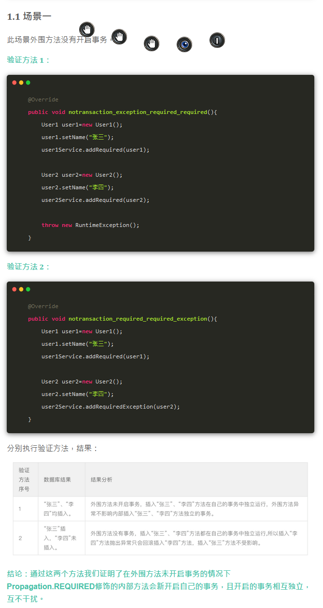
    - **内外事务均`REQUIRED`，组成为一个事务，任一回滚都会事另一个回滚**
      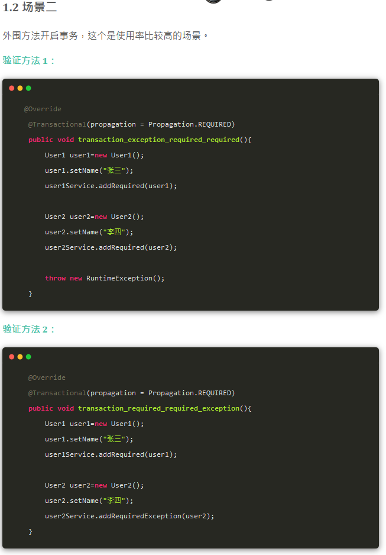

      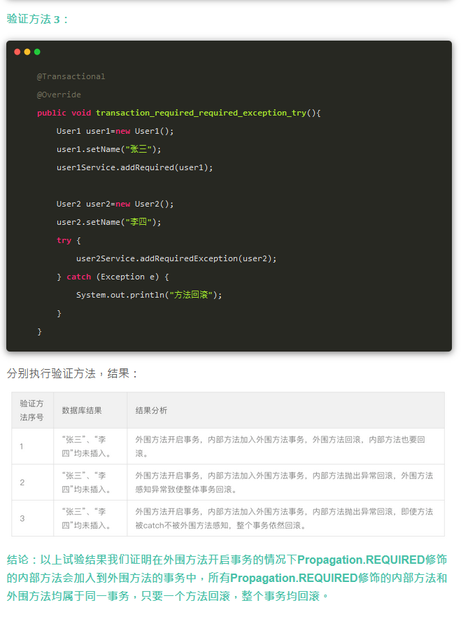

- `REQUIRES_NEW`：**独立事务，不受其他事务影响**

  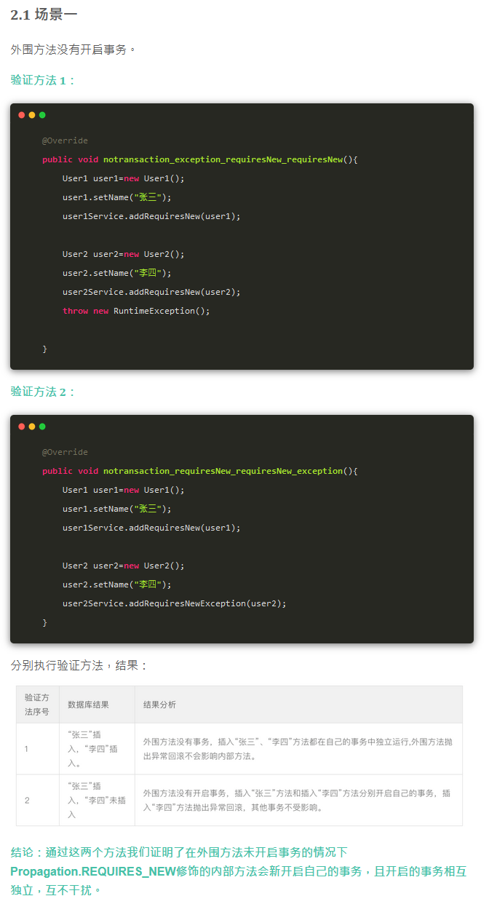

  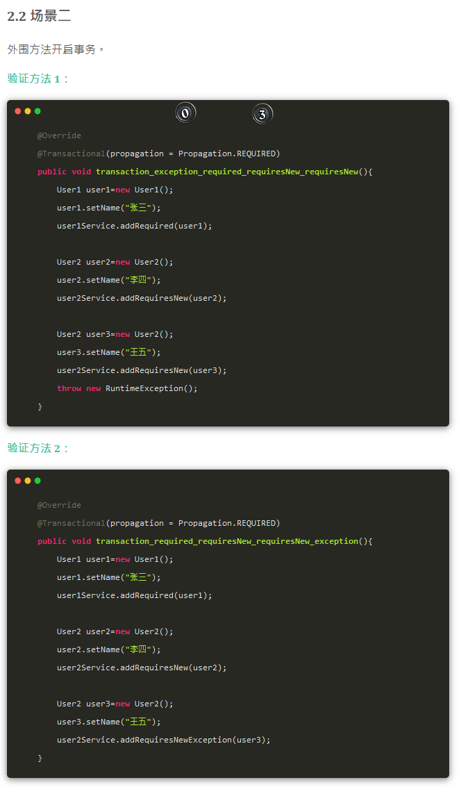

  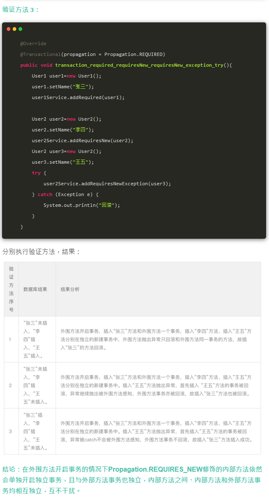

- `NESTED`
    - **若无外部事务，则创建独立事务**
      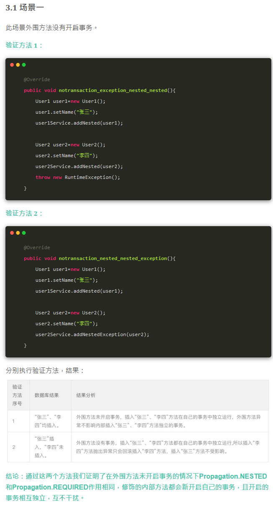
    - **若有外部事务，受外部事务回滚而回滚，但自身回滚不会导致其他事务回滚**
      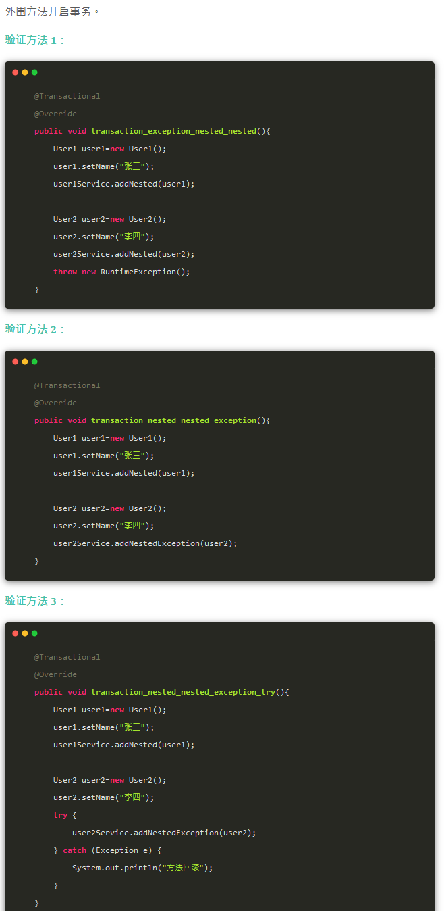

      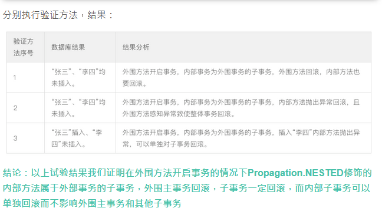
- `MANDATORY`：若方法**无**事务，则异常
- `NEVER`：若方法**有**事务，则异常
- `SUPPORTS`：非事务，外部有事务会加入
- `NOT_SUPPORTED`：非事务，挂起外部事务

## 循环依赖

https://mp.weixin.qq.com/s/kS0K5P4FdF3v-fiIjGIvvQ

### Spring可处理的情况

* 出现循环依赖的Bean必须要是单例
* 依赖注入的方式不能全是构造器注入

### 三级缓存

1. 一级：单例池，存储的是所有创建好了的单例Bean
2. 二级：完成实例化，但是还未进行属性注入及初始化的对象
3. 三级：提前暴露的一个单例工厂，二级缓存中存储的就是从这个工厂中获取到的对象

### 处理过程

当A、B两个类发生循环引用时，在A完成实例化后，就使用实例化后的对象去创建一个对象工厂，并添加到三级缓存中，如果A被AOP代理，那么通过这个工厂获取到的就是A代理后的对象，如果A没有被AOP代理，那么这个工厂获取到的就是A实例化的对象。

当A进行属性注入时，会去创建B，同时B又依赖了A，所以创建B的同时又会去调用getBean(a)来获取需要的依赖，此时的getBean(a)会从缓存中获取：

1. 先获取到三级缓存中的工厂；

2. 调用对象工工厂的getObject方法来获取到对应的对象，得到这个对象后将其注入到B中

3. B开始创建

### 二级缓存不能解决

如果要使用二级缓存解决循环依赖，意味着所有Bean在实例化后就要完成AOP代理，这样违背了Spring设计的原则，Spring在设计之初就是通过AnnotationAwareAspectJAutoProxyCreator这个后置处理器来在Bean生命周期的最后一步来完成AOP代理，而不是在实例化后就立马进行AOP代理。

---

# SpringMVC

### 与Struts

|      |             Struts              | SpringMVC |
|:-----|:-------------------------------:|:---------:|
| 拦截机制 |               类级别               |   方法级别    |
| 作用域  |               多例                | 默认单例，可指定  |
| 底层框架 |             Filter              |  Servlet  |
| 性能   | 每次请求对应实例一个新的Action，需要加载所有的属性值注入 |   单例性能高   |

### DispatcherServlet

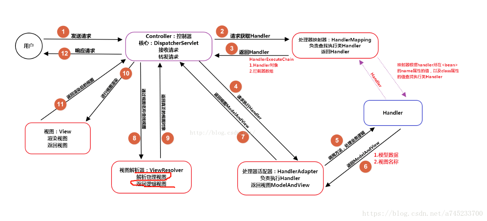

### @ResponseBody和@RequestBody

* `@ResponseBody`: 表示该方法的返回结果不会被解析为跳转路径，而是直接写入 HTTP请求返回体中，

* `@RequestBody`: 作用在形参列表上，用于将前台发送过来固定格式的数据封装为对应的 JavaBean 对象， 封装时使用到的一个对象是系统默认配置的 HttpMessageConverter 进行解析，然后封装到形参上。