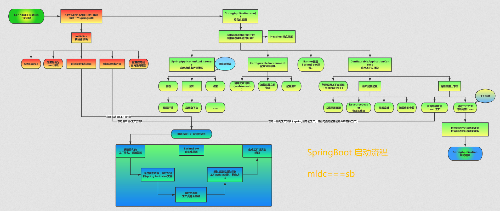

# SpringBoot

---

### `@SpringBootConfiguration`功能

* `@Configuration`：配置包含@bean修饰的方法的类
* `@ComponentScan`：组件扫描
* `@EnableAutoConfiguration`：启用自动配置，`exclude`属性可以关闭某个自动配置的选项

### 自动装配

通过 `SpringFactoriesLoader` 最终加载META-INF/spring.factories中的自动配置类实现自动装配，自动配置类是通过`@Conditional`按需加载的配置类，想要其生效必须引入`spring-boot-starter-xxx`包实现起步依赖

### [`@Configuration`与`@Component`](https://www.jb51.net/article/153430.htm)

* `@Configuration`，基于`@Component`，类中被`@Bean`修饰的方法所创建的bean都是单例

### 启动流程



### 读取配置

* ` @Environment`：Spring组件扫描
* ` @PropertySource`：组合了 `@Configuration`，实现配置文件的功能。
* ` @Value`

```java

@Component
@PropertySource(value = {"config/redis.properties"})  // 读取非默认properties中的变量(无法读取yml配置)
public class InfoConfig1 {
    @Value("${info.address}")
    @Getter
    @Setter
    private String address;
}
```

* ` @ConfigurationProperties`

```java

@Component
@ConfigurationProperties(prefix = "xxx")
@PropertySource(value = {"config/redis.properties"})  // 读取非默认properties中的变量(无法读取yml配置)
public class InfoConfig1 {
    @Getter
    @Setter
    private String address;
}
```

### 配置加载顺序

1. 开发者工具 `Devtools` 全局配置参数；
2. 单元测试上的 `@TestPropertySource` 注解指定的参数；
3. 单元测试上的 `@SpringBootTest` 注解指定的参数；
4. 命令行指定的参数，如 `java -jar springboot.jar --name="xxx"`；
5. 命令行中的 `SPRING_APPLICATION_JSONJSON` 指定参数, 如 `java -Dspring.application.json='{"name":"xxx"}' -jar springboot.jar`
6. `ServletConfig` 初始化参数；
7. `ServletContext` 初始化参数；
8. JNDI参数（如 `java:comp/env/spring.application.json`）；
9. Java系统参数（来源：`System.getProperties()`）；
10. 操作系统环境变量参数；
11. `RandomValuePropertySource` 随机数，仅匹配：`ramdom.*`；
12. JAR包外的配置文件参数（`application-{profile}.properties（YAML）`）
13. JAR包内的配置文件参数（`application-{profile}.properties（YAML）`）
14. JAR包外的配置文件参数（`application.properties（YAML）`）
15. JAR包内的配置文件参数（`application.properties（YAML）`）
16. `@Configuration`配置文件上 `@PropertySource` 注解加载的参数；
17. 默认参数（通过 `SpringApplication.setDefaultProperties` 指定）；

### 2.0新特性

* 配置变更
* JDK 版本升级 (1.8+)
* 第三方类库升级 (spring 5+, Tomcat)
    * Spring 3.X + → Spring 5.X +
    * Tomcat 6.0 + → Tomcat 8.5 +
* 响应式 Spring 编程支持
* HTTP/2 支持
* 配置属性绑定

### 自定义starter

在resources路径下面创建META-INF目录，然后创建spring.factories文件，

`org.springframework.boot.autoconfigure.EnableAutoConfiguration=启动类全限定类名`

### 启动时向控制台打印毫秒值

* banner

       @Component
       public class MyBean implements CommandLineRunner {
           public void run(String... args) {
              ...
           }
       }

或

        @Component
         public class MyBean implements ApplicationRunner {
              public void run(String... args) {
                ...
              }
         }

