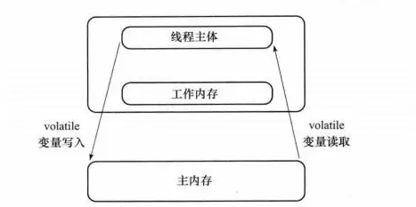
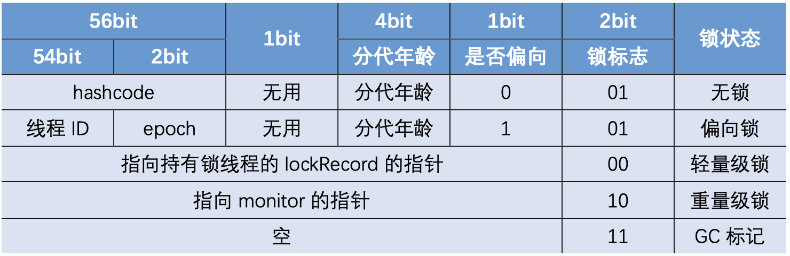
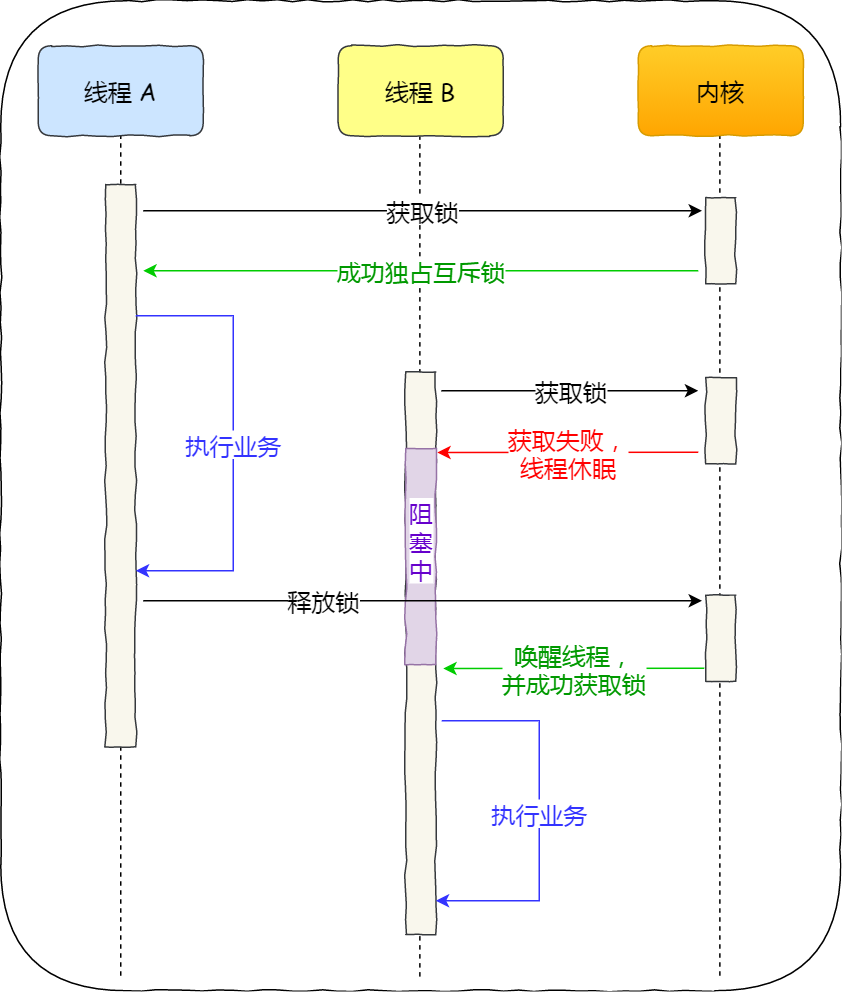

# Thread

---

[详细总结](https://www.cnblogs.com/skywang12345/p/java_threads_category.html)

### [线程状态](https://baijiahao.baidu.com/s?id=1658121385190352035)


* ***New***：`Thread t = new Thread()`
* ***Runnable***
    * ***Running***：正在被CPU调度
    * ***Ready***：start()之后所处的状态，随时可被CPU调度
      - start()：New -> 
      - yield()：Running -> 
      - sleep(long): Waiting -》 
      - 任意线程join()结束之后:
      - 获得对象锁之后:
* ***Waiting***：当前线程需要等待其他线程做出一些的特定的动作（通知或中断）
* ***Timed_Waiting***：可以在指定的时间自行返回的`Waiting`
* ***Blocked***：失去CPU调度，比如等待进入**synchronized同步方法（代码块）** 时的状态
* ***Terminated***：**执行完毕** 或者 **因异常退出**

### start()使用限制

> 一个线程只能调用一次

### 实现多线程的4种方式

* ***线程池***
* ***实现Callable***：始于1.5，有返回值，可抛异常
* ***实现Runnable***：始于1.0，无返回值，不抛异常
* ***继承Thread***

### 线程池提交任务的两种方法

* `execute()`：提交后不管，无法判断任务执行的状态和结果
* `submit()`：返回一个`Future`对象，通过它可判断任务是否执行成功，此对象内含2中方法：
    - `get()`：会阻塞当前线程直到任务完成后获取返回值
    - `get(long timeout，TimeUnit unit)`：会阻塞当前线程一段时间后立即返回任务返回值（有可能任务没有执行完）

### 死锁的4个条件

* ***互斥*** ：资源在任意时刻只被1个线程占用
* ***保持并请求*** ：1个线程因请求资源而阻塞时，不释放已获得的其他资源
* ***不剥夺*** ：线程已获得的资源在未使用完之前不能被其他线程抢走
* ***循环等待***

```java
public class 死锁实例 {
    private static Object A = new Object();
    private static Object B = new Object();

    public static void main(String[] args) {
        new Thread(() -> {
            synchronized (A) {
                System.out.println(Thread.currentThread() + "get A");
                try {
                    Thread.sleep(1000);
                } catch (InterruptedException e) {
                    e.printStackTrace();
                }
                System.out.println(Thread.currentThread() + "waiting get B");
                synchronized (B) {
                    System.out.println(Thread.currentThread() + "get B");
                }
            }
        }, "线程 1").start();

        new Thread(() -> {
            synchronized (B) {
                System.out.println(Thread.currentThread() + "get B");
                try {
                    Thread.sleep(1000);
                } catch (InterruptedException e) {
                    e.printStackTrace();
                }
                System.out.println(Thread.currentThread() + "waiting get A");
                synchronized (A) {
                    System.out.println(Thread.currentThread() + "get A");
                }
            }
        }, "线程 2").start();
    }
}
```

### 方法区别

|      |    `wait()`     |   `yield()`   |    `sleep()`    |
|:-----|:---------------:|:-------------:|:---------------:|
| 状态切换 | Running→Blocked | Running→Ready | Running→Blocked |
| 锁释放  |        √        |       ×       |        ×        |
| 来源   |     Object      |    Thread     |     Thread      |

### 保证线程执行顺序

* 在主线程里依次调用每个线程的`join()`
* `SingleThreadExecutor`依次提交每个线程
* `Semaphore`、`Condition`等

---

## volatile

### 实现原理

* 通过读写主内存保证变量的可见性
* 通过插入读写屏障禁止指令重排，解决单例双重检查对象初始化代码执行乱序
* 不能保证原子性，不阻塞线程

### 内存模型


volatile修饰后



### 应用

- `AtomicInteger`：CAS+volatile
- 线程安全的单例

---

## ThreadLocal

使每个线程在其内部维护这个值的副本，避免互相干扰

### 原理

`ThreadLocal`的静态内部类`ThreadLocalMap`为每个`Thread`都维护了一个数组

每个线程都有自己的`ThreadLocalMap`变量，用来存放对应值。`Entry`里key为`ThreadLocal`对象，value即为这个对象的线程专属值

### 内存泄漏

`ThreadLocalMap`中使用的 key 为`ThreadLocal`的弱引用,而 value 是强引用。如果`ThreadLocal`没有被外部强引用的情况下，在垃圾回收的时候，key
会被清理掉，而value不会被清理掉。这样一来，`ThreadLocalMap`中就会出现key为`null`的`Entry`。假如我们不做任何措施的话，value 永远无法被GC
回收，这个时候就可能会产生内存泄露。`ThreadLocalMap`实现中已经考虑了这种情况，在调用`set()`、`get()`、`remove()`方法的时候，会清理掉 key 为`null`的记录。使用完`ThreadLocal`
方法后需要手动调用`remove()`

#### 值为什么不是用弱引用

不清楚这个Value除了map的引用还是否还存在其他引用，若设置为弱引用可能导致数据丢失

### 应用场景

* `ImageBufferCache`
* Spring的`TransactionSynchronizationManager`：保证单个线程中的数据库操作使用的是同一个数据库连接

---

## [synchronized](https://tech.youzan.com/javasuo-yu-xian-cheng-de-na-xie-shi/)

### 实现机制

排它锁，禁止指令重排

* 方法（实例同步方法和类同步方法）

`ACC_SYNCHRONIZED`调用了`monitorenter`和`monitorexit`

* 代码块

编译之后在同步的代码块前后加上`monitorenter`和`monitorexit`字节码指令，依赖操作系统底层互斥锁实现

* `monitorenter`：执行时尝试获取对象锁，获取成功则计数器+1并设置`owner`为此线程，其他竞争锁的线程则会进入`entryList`
* `monitorexit`：执行时把计数器-1，当计数器值为0时，则锁释放并设置`owner=NULL`，处于`entryList`中的线程再继续竞争锁
* `entryList`：竞争锁队列，线程调用`notify()`/`notifyAll()`后进入
* `waitSet`：待唤醒队列，线程调用`wait()`后进入
  

一个对象仅有一个同步锁，调用对象的synchronized方法时，就获取了对象的同步锁，对象的同步锁不能被多个线程同时持有

* 一个线程访问“某对象”的“synchronized方法”或者“synchronized代码块”时，其他线程对“该对象”的该“synchronized方法”或者“synchronized代码块”的访问将被阻塞。
* 一个线程访问“某对象”的“synchronized方法”或者“synchronized代码块”时，其他线程仍然可以访问“该对象”的非同步代码块。
* 一个线程访问“某对象”的“synchronized方法”或者“synchronized代码块”时，其他线程对“该对象”的其他的“synchronized方法”或者“synchronized代码块”的访问将被阻塞。

### Lock与synchronized

|       | synchronized |   Lock   |
|:------|:------------:|:--------:|
| 性质    |     关键字      |    接口    |
| 释放锁   |      自动      |    手动    |
| 可中断   |      ×       |    √     |
| 锁获取状态 |      未知      |    可知    |
| 范围    |    方法、代码块    |   代码块    |
| 公平锁   |     非公平锁     | 公平锁、非公平锁 |

[更多介绍](https://javaguide.cn/java/concurrent/reentrantlock.html#_2-3-1-%E7%BA%BF%E7%A8%8B%E5%8A%A0%E5%85%A5%E7%AD%89%E5%BE%85%E9%98%9F%E5%88%97)
---

## 锁

### 锁类型

* 范围上：
    * 实例锁：锁在具体实例对象上。如果该类是单例，那么该锁也具有全局锁的概念。对应的就是synchronized关键字。
    * 全局锁：该锁针对的是类，它的所有实例竞争同一把锁。`static synchronized`（或者是锁在该类的class或者classloader对象上）
* 竞争方式上：
  [公平锁与非公平锁](https://www.imooc.com/article/302143)

* 偏向锁：

当线程访问同步块获取锁时，会在`Mark Word`中记录里存储偏向锁的线程ID，如果后续没有其他线程获得过这个锁，之后这个线程可以直接进入同步块。 当有其他线程竞争偏向锁时，持有偏向锁的线程就会释放偏向锁。`-XX:+UseBiasedLocking`开启偏向锁。


* 互斥锁：
* 读优先锁：
* 写优先锁：
* 乐观锁：
    * 先写，改完验证是否变更过，变更过放弃，否则提交（eg：git、在线文档）
    * 实现：加额外字段（版本号、时间戳）校验修改记录
* 悲观锁：
    * 写之前必须先拿锁
    * 实现：关闭`set autocommit=0`,`select ... for update`加锁, 完成后`commit`释放锁

### CAS

    乐观锁的一种，不一定安全（ABA，可用版本号解决）


### 锁消除

    JVM检测到一些同步的代码块，完全不存在数据竞争的场景，也就是不需要加锁，就会进行锁消除

### 锁粗化

    有很多操作都是对同一个对象进行加锁，就会把锁的同步范围扩展到整个操作序列之外

### 自适应

    由前一次在同一个锁上的自旋时间和锁的持有者状态来决定自旋的时间

### 锁升级


`prototype_header`：每个类有一个类似mark word的prototype_header，记录类的epoch和偏向开关等信息。

`匿名偏向状态`：锁对象mark word标志位为101，且存储的Thread ID为空时的状态(即锁对象为偏向锁，且没有线程偏向于这个锁对象)。

---

## 线程池

### 主要参数

- ***线程工厂***
- ***核心线程***
- ***阻塞队列***：保证任务队列中没有任务时阻塞获取任务的线程，使得线程进入wait状态，释放cpu资源
- ***线程上限***
- ***空闲时间***：线程池中线程数＞**核心线程**时，线程的空闲时间如果＞**空闲时间**，那么这个线程就会被销毁，直到线程池中的线程数≤核心线程数
- ***线程饱和策略***
    * ***Abort***（**默认**）：丢弃新任务，抛`RejectedExecutionException`
    * ***Discard***：。丢弃新任务，不抛异常
    * ***CallerRuns***：请调用线程去处理此任务
    * ***DiscardOldest***：丢弃队列头的任务，然后重新尝试执行此任务(重复此过程)

### 工作流程


### 停止


* ***shutDown()***：停止接受新任务，等待执行的任务停止执行，正在执行的任务完后线程池退出
* ***shutDownNow()***：试图停止正在执行的任务，停止接受新任务，等待执行的任务停止执行，正在执行的任务完后线程池退出

### Executors中的线程池

| 线程池                  | corePoolSize |  maximumPoolSize  | keepAliveTime |          workQueue           |                         特点                          |
|:---------------------|:------------:|:-----------------:|:-------------:|:----------------------------:|:---------------------------------------------------:|
| FixedThreadPool      |    自定义值x     |       自定义值x       |       0       | LinkedBlockingQueue （无界阻塞队列） |                 固定线程数伸缩性差、无界队列会OOM                  |   
| SingleThreadExecutor |      1       |         1         |       0       | LinkedBlockingQueue（无界阻塞队列）  |               无界队列会OOM、仅适用于需要保证任务执行顺序               |
| CachedThreadPool     |      0       | Integer.MAX_VALUE |      60秒      |   SynchronousQueue（没有数据缓冲）   |                    无线程上限，可能耗尽CPU                    |
| ScheduledThreadPool  | corePoolSize | Integer.MAX_VALUE |       0       |  DelayedQueue（线程安全、带有延迟元素）   | 执行延时或者周期性任务，**出现未捕获的异常会取消后续任务的执行**（推荐使用`@Schedule`） |

### 核心线程数的确定

具体需要结合实际，多次测试得出最佳实践，通常：

- `IO密集型`：核数*2
- `CPU密集型`：核数+1

---

## [AQS(AbstractQueuedSynchronizer)](https://javaguide.cn/java/concurrent/aqs.html#aqs-%E7%AE%80%E5%8D%95%E4%BB%8B%E7%BB%8D)

### 核心思想

    如果被请求的资源空闲，则将此线程设置为有效的工作线程，锁定资源。如果资源被占用，将线程加入到队列中等待被唤醒。

### 资源共享方式

- **独占**：最多有一个线程占用资源
- **共享**：可以有多个线程占用资源
    - Semaphore：用于限制获取某种资源的线程数量，类似于发放通行证。**默认非公平**
        - `acquire(int n)`：会阻塞，直到获取到n个通行证
        - `release(int n)`：回收一个通行证
        - `tryAcquire(int n,long waitTime)`：获取n个通行证，超过waitTime后返回false
    - CountDownLatch ：基于AQS，构造参数会设置为AQS的`state`。运行完的线程会阻塞直至所有线程运行完，然后运行主线程。
        - `countDown()`：线程结束后调用此方法，表示已执行
        - `await()`：主线程执行此方法后进入阻塞状态，直至state==0（所有线程执行完毕）
    - CyclicBarrier ：基于AQS，构造参数会设置为AQS的`state`。让一组线程到达一个屏障（也可以叫同步点）时被阻塞，直到最后一个线程到达屏障时，屏障才会开门，所有被屏障拦截的线程才会继续干活。
        - `await()`：执行线程的`run()`中，`CyclicBarrier`调用此方法表明此线程已到达“栅栏”

### CountDownLatch和CyclicBarrier

* ***CountDownLatch***的下一步的动作实施者是主线程，具有不可重复性
* ***CyclicBarrier***的下一步动作实施者还是***其他线程***本身，具有往复多次实施动作的特点

### 公平锁

- **非公平锁**：队列中所有线程竞争取锁，`ReentrantLock`默认此模式
- **公平锁**：按队列顺序排队取锁
