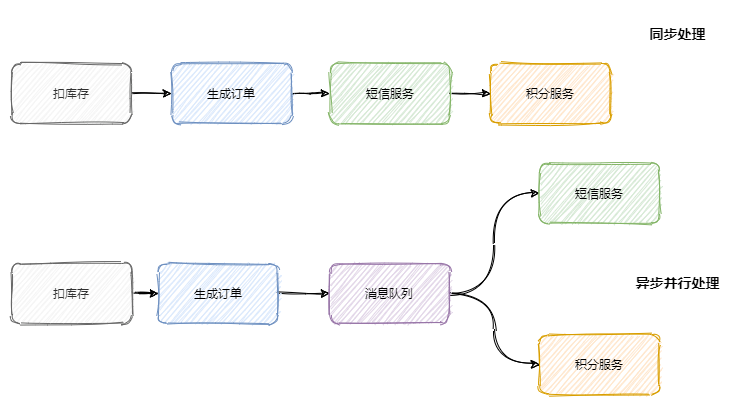
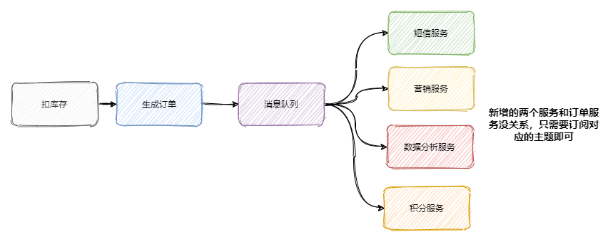
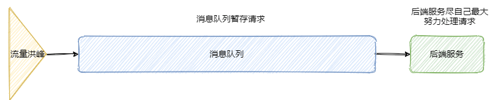
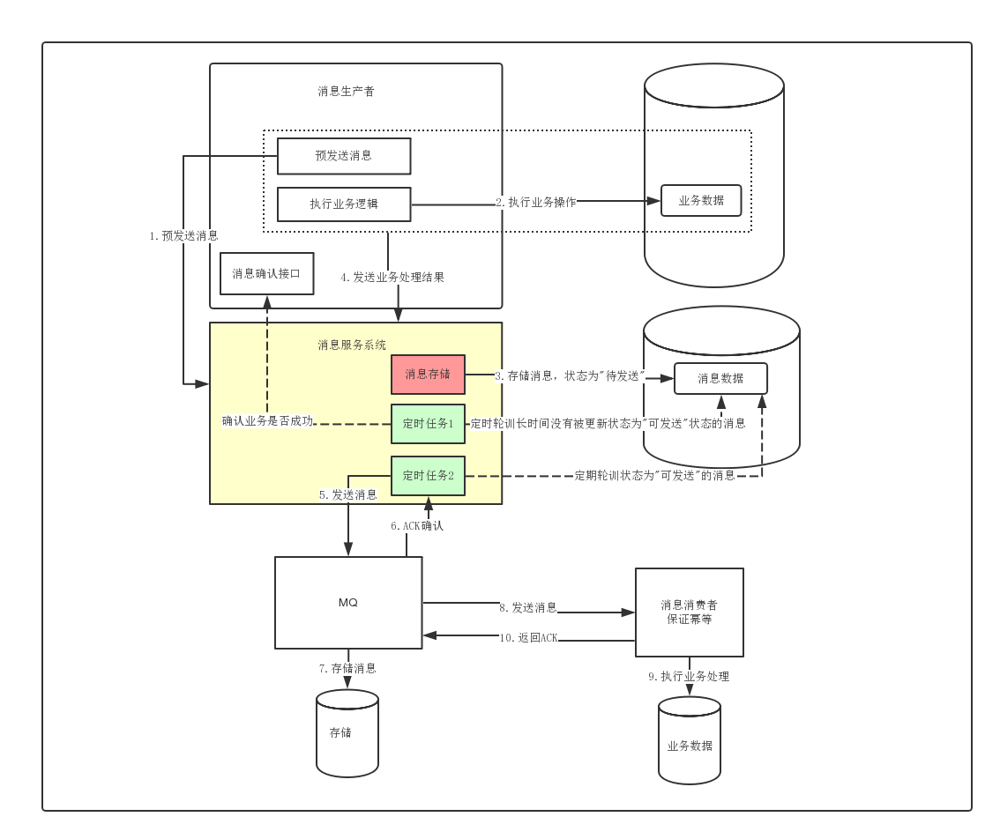

# MQ

---

### 用途

* 异步：长调用链缩短返回时间
  
* 解耦
  
* 削峰
  

### 丢失（分布式事务）

|                   |                                            RocketMQ                                             |            kafka             |
|:------------------|:-----------------------------------------------------------------------------------------------:|:----------------------------:|
| Producer发送过程中网络抖动 | **自动重试**或者**使用事务型消息**：①向broker发送half message ②broker ACK之后再执行本地业务，根据结果决定`commit`/`rollback` | 使用带回调的发送、设置重试次数、设置`acks=all` |
| Broker收到消息后刷盘失败   |                                     刷盘策略改为同步，指定时间内未完成则判定失败                                      |        确保多个副本落盘之后再ACK        |
| Consumer          |                                     业务执行成功之后再ACK，执行失败返回稍后重试                                     |  `enable.auto.commit=false`  |

### 重复

    幂等

### 有序

* **全局**：单个队列

* **局部**：需要保证顺序的消息放入同一队列,消费时也只能有一个线程来消费
    * **kafka**：中发送1条消息的时候，可以指定(topic, partition, key)
    * **RocketMQ**：SelectMessageQueueByHash可以对主键Hash取模使其进入同一个队列

### 对比

|        |      RocketMQ       |          kafka          |
|:-------|:-------------------:|:-----------------------:|
| 刷盘策略   | 同步刷盘、同步备份、异步刷盘、异步备份 |        异步刷盘、异步备份        |
| 单机TPS  |    十万级（业务场景、GC）     | 百万级（Producer合并消息，bulk发） |
| 消费失败重试 |          √          |            ×            |
| 定时消息   |          √          |            ×            |
| 消息查询   |          √          |            ×            |

---

## kafka

### 高性能

https://mp.weixin.qq.com/s/kMIhPW2uLdy-mgS9sF6agw

### 三种消费模式

* **至多1次**：关闭自动提交，先commit再执行
* **至少1次**：关闭自动提交，先执行再commit
* **正好1次**：关闭自动提交，先幂等执行再commit