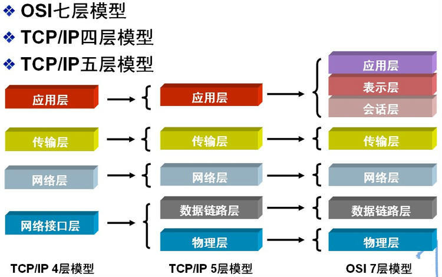
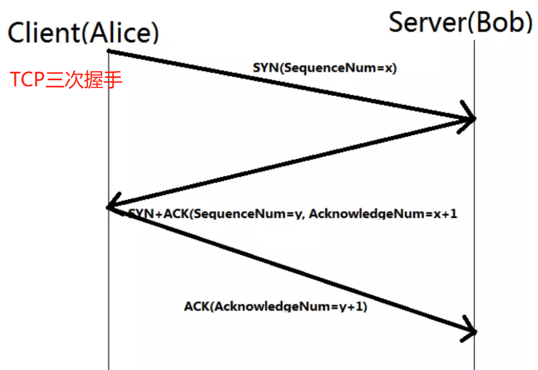
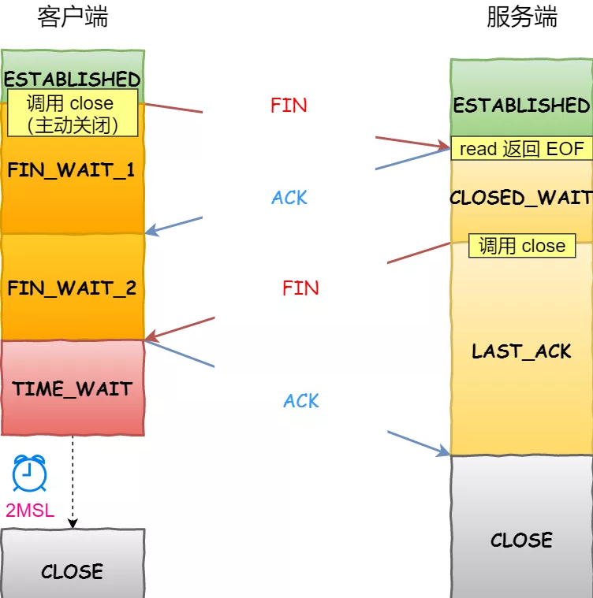
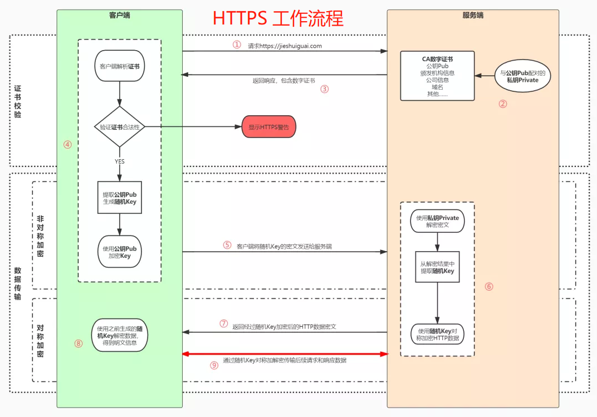

# 网络

https://mp.weixin.qq.com/s/t7ZYT6wBBbFYVBPOSztpRg
---

## 网络模型

---

## TCP与UDP

| **TCP与UDP** |   TCP   |  UDP  |
|:------------|:-------:|:-----:|
| **面向连接**    |    √    |   ×   |
| **预先连接**    |    √    |   ×   |
| **头大小**     | ≥20Byte | 8Byte |
| **可靠**      |    √    |   ×   |
| **传输形式**    |   字节流   | 数据报文段 |
| **速度**      |    慢    |   快   |

### 与IP

> IP协议在数据流转中涉及多个IP地址，TCP可实现端对端（2个IP之间）的高效传播

### 三次握手

同步双方SYN，防止旧的重复连接的初始化

#### SYN超时和风险

* 默认重试5次，每次间隔为1/2/4/8/16/32s，共计63s后断开
* 为避免SYN攻击，可通过调整tcp_synack_retries、tcp_max_syn_backlog解决

### 四次挥手

[四次挥手](https://mp.weixin.qq.com/s/ytV7RZSyFXyvPW_lKhv8hw)

---

## Http与Https

|     | Http |    Https    |
|:---:|:----:|:-----------:|
| 结构  |      |  额外SSL/TLS  |
| 速度  |  快   |      慢      |
| 端口  |  80  |     443     |
| 连接  | 三次握手 | 额外SSL/TLS握手 |

### cookie和session

|      | cookie |   session   |
|:----:|:------:|:-----------:|
| 存储位置 |  浏览器   |     服务端     |

#### 禁用cookie后识别用户

> 将session_id写入`payload`、`url`、`header`

### 版本

|     |     1.0     |  1.1   |            2.0            |
|:----|:-----------:|:------:|:-------------------------:|
| 安全  | 明文，无法验证对方身份 | 支持身份认证 |                           |
| 连接  |    每次都新建    |  长连接   |   多路复用，同一个连接内用id区分不同请求    |
| 格式  |             | ASCII  |            二进制            |
| 其他  |    队头阻塞     | 支持断点续传 | Header压缩、Server Push（预推送） |

### `GET`和`POST`

|        |   `GET`    | `POST`  |
|:-------|:----------:|:-------:|
| 参数位置   |    URL     | Payload |
| 可见性    |     明显     |   不明显   |
| 请求大小   | 浏览器限制URL长度 |    无    |
| 被浏览器缓存 |     自动     |   手动    |
| 编码     | URL Encode |   任意    |

### `Forward`和`Redirect`

|     |                                   `Forward`                                    |            `Redirect`             |
|:----|:------------------------------------------------------------------------------:|:---------------------------------:|
| 区别  | 只发出一次请求，Servlet、HTML、JSP或其它信息资源，由第二个信息资源响应该请求，在请求对象request中，保存的对象对于每个信息资源是共享的。 | 服务器端在响应第一次请求的时候，让浏览器再向另外一个URL发出请求 |

### Https工作流程

### 从输入网址到页面加载

1. 浏览器开启一个线程来处理这个请求，对URL判断如果是http协议就按照web方式处理

2. 浏览器先查看浏览器缓存-系统缓存-路由器缓存，如果缓存中有，会直接在屏幕中显示页面内容（此时没有向服务端发请求）。若没有，则进行下一步操作（后面需要向服务端发送请求）

3. 通过DNS解析获取网址的IP地址

4. 向真实IP地址服务器发起tcp连接，与浏览器建立tcp三次握手

5. 握手成功后，进行HTTP协议会话，浏览器发送报头(请求报头)

6. 进入到web服务器上的 Web Server里的web service，找到对应的请求处理

7. 处理结束回馈报头，将数据返回至浏览器

8. 浏览器开始下载html文档(响应报头，状态码200)，同时设置缓存

## Netty

https://mp.weixin.qq.com/s/eJ-dAtOYsxylGL7pBv7VVA