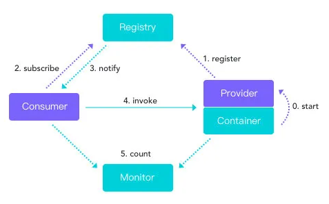
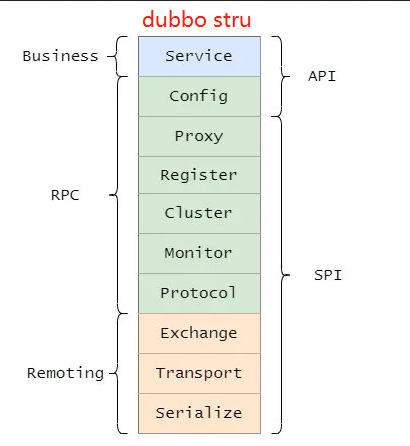
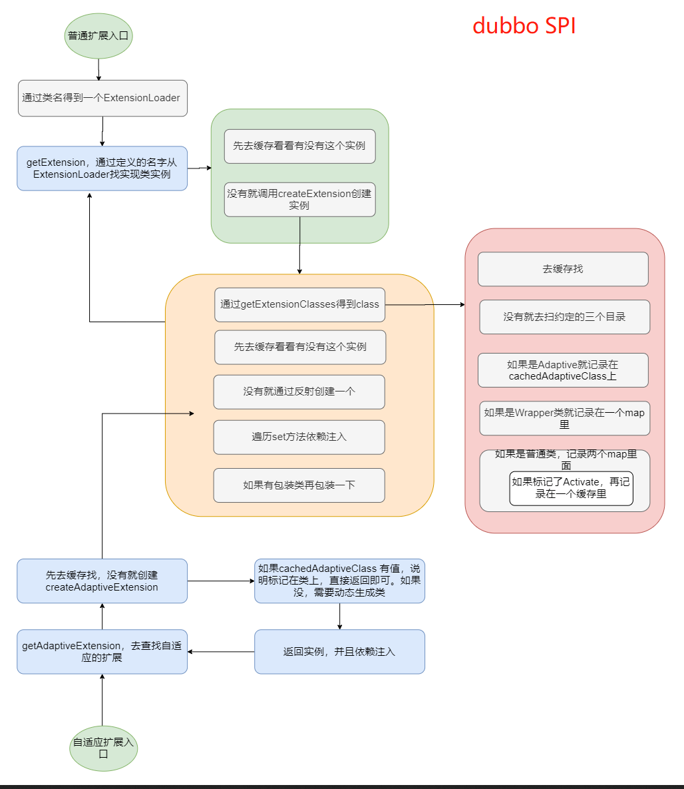
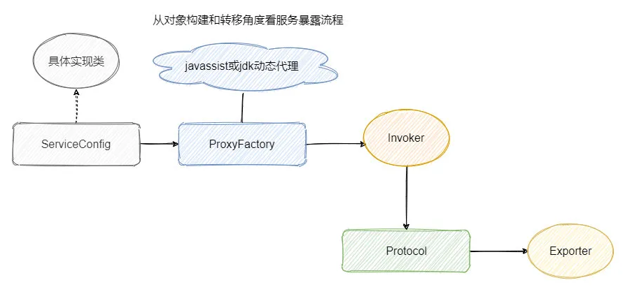
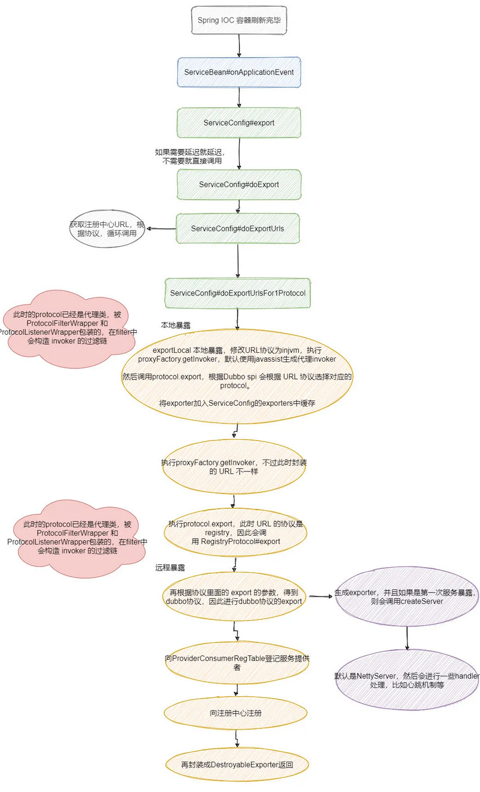
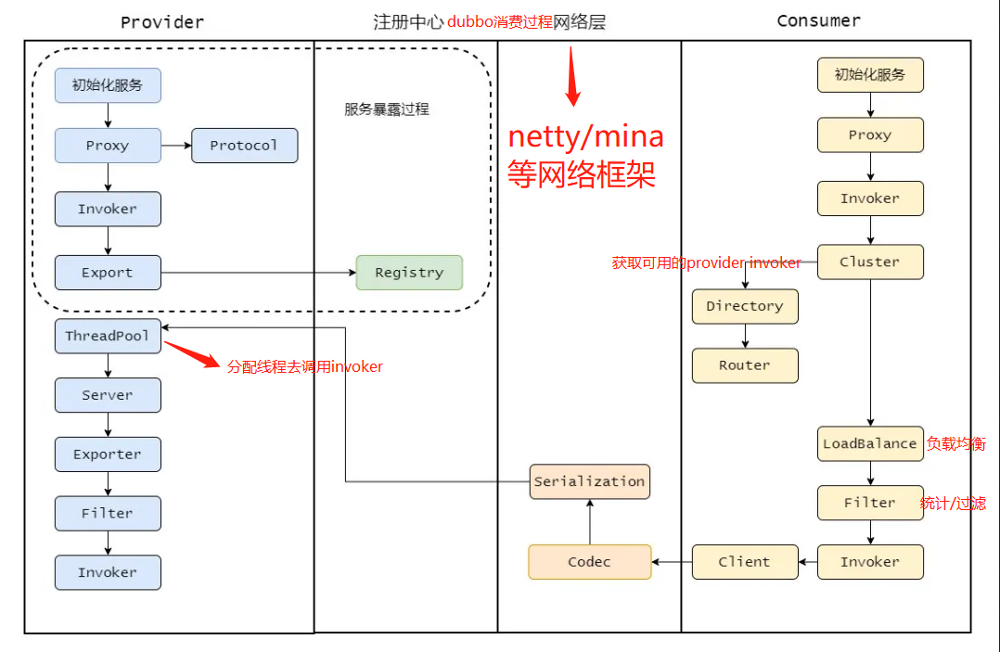
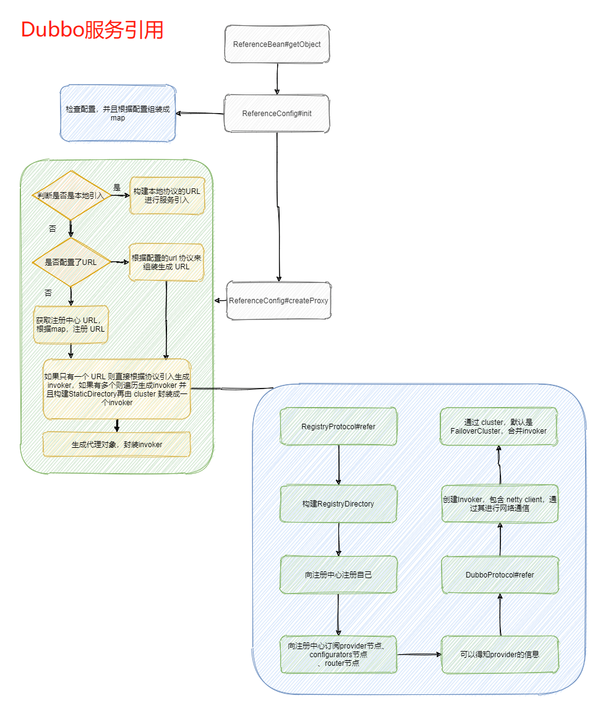
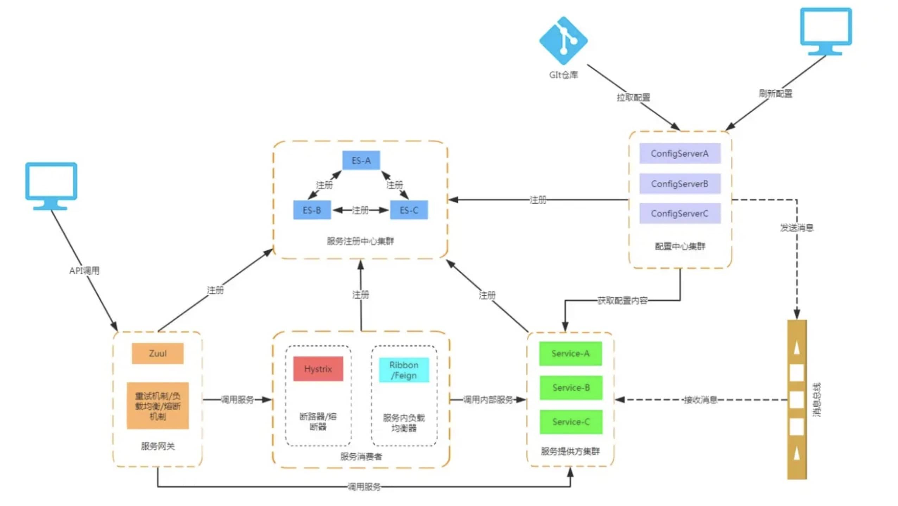

# Dubbo

https://mp.weixin.qq.com/s/FwL6qArqYc2ENymXk1eZFQ
---

### 启动

### 结构

* ***Service***：业务逻辑层

* ***Config***：初始化配置信息

* ***Proxy***：为`Provider`和`Comsumer`生成代理类，进行远程调用和结果返回

* ***Register***：封装服务注册和发现

* ***Cluster***：负责选取具体调用的节点，处理特殊的调用要求和负责远程调用失败的容错措施

* ***Monitor***：监控统计调用时间和次数

* ***Protocol***：封装 RPC 调用，负责管理 Invoker，Invoker代表一个抽象封装了的执行体

* ***Exchange***：封装请求响应模型，同步转异步。

* ***Transport***：抽象网络传输，用户可在此指定网络层实现

* ***Serialize***：将数据序列化成二进制流，当然也做反序列化。

### 各部分间连接

* `Register`、`Provider`和`Comsumer`之间是长连接，其他是短连接

* `Comsumer`直接调用`Provider`

* `Register`和`Monitor`宕机不影响正常运行的`Provider`和`Comsumer`，因为`Comsumer`本地有缓存`Provider`的信息

### 支持协议

* 通信协议
    * dubbo：
    * rmi：
    * hessian：
    * http：
    * webservice：
* 序列化协议
    * hessian（默认）：
    * json：
    * Protocol Buffer：序列化之后得到的数据是二进制流，通过`.proto`文件定义数据格式，压缩后体积很小
    * SOAP

### SPI

JDK 内置的一个服务发现机制，它使得接口和具体实现完全解耦。 在META-INF/services目录下放置一个与接口同名的文本文件，文件的内容为接口的实现类，多个实现类用换行符分隔。 这样就通过配置来决定具体用哪个实现

### 服务暴露

### 服务调用

### 服务引用

### 负载均衡模式

* ***Random***：加权随机，假设有两台服务器 A 和 B，想让 70% 的请求落到 A 上，30% 的请求落到 B上，只要搞个随机数生成范围在 [0,10)，小于7则指向A，否则指向B
* ***LeastActive***：最少活跃数，活跃数都是从 0 加起来的，来一个请求活跃数+1，一个请求处理完成活跃数-1，优先指向活跃数最少的，相等则比较权重
* ***ConsistentHash***：一致性 Hash，将 hash值空间设为0~2^32-1的圆环，将服务器的 IP 等信息生成一个 hash 值，将这个值投射到圆环上作为一个节点，然后当 key 来查找的时候顺时针查找第一个大于等于这个 key 的 hash 值的节点
* ***RoundRobin***：加权轮询，假设有两台服务器 A、B，轮询的调用顺序就是 A、B、A、B....，如果加了权重，A比B 的权重是3:1，那现在的调用顺序就是 A、A、A、B、A、A、A、B....

### 容错策略

* ***fail over***：重试其它服务器，用于读操作（推荐使用）
* ***fail fast***：立即报错，不再次调用，用于非幂等性的写操作
* ***fail safe***：直接忽略，用于写入审计日志等操作
* ***fail back***：后台记录失败请求，定时重发。通常用于消息通知操作，重启会丢失
* ***forking***：只要一个成功即返回，通常用于实时性要求较高的读操作，浪费较多服务资源
* ***broadcast***：广播调用，所有提供逐个调用，任意一台报错则报错。通常用于更新提供方本地状态 速度慢，任意一台报错则报错

---

# SpringCloud

### Eureka

由于某些原因，employee-consumer公开服务会引发异常。在这种情况下使用Hystrix我们定义了一个回退方法。如果在公开服务中发生异常，则回退方法返回一些默认值。

### Eureka和ZooKeeper的区别

* ZooKeeper保证的是CP,Eureka保证的是AP

  ZooKeeper在选举期间注册服务瘫痪,虽然服务最终会恢复,但是选举期间不可用的 Eureka各个节点是平等关系,只要有一台Eureka就可以保证服务可用,而查询到的数据并不是最新的

    * Eureka不再从注册列表移除因长时间没收到心跳而应该过期的服务

    * Eureka仍然能够接受新服务的注册和查询请求,但是不会被同步到其他节点(高可用)
    * 当网络稳定时,当前实例新的注册信息会被同步到其他节点中(最终一致性)

  Eureka可以很好的应对因网络故障导致部分节点失去联系的情况,而不会像ZooKeeper一样使得整个注册系统瘫痪
* ZooKeeper有Leader和Follower角色,Eureka各个节点平等
* ZooKeeper采用过半数存活原则,Eureka采用自我保护机制解决分区问题
* Eureka本质上是一个工程,而ZooKeeper只是一个进程

### Hystrix

* 由于某些原因，employee-consumer公开服务会引发异常。在这种情况下使用Hystrix我们定义了一个回退方法。如果在公开服务中发生异常，则回退方法返回一些默认值。

---

# thrift

### [thrift入门](https://www.jianshu.com/p/166efddfcb20)

---

# 注册中心

|         |           Nacos            |   Eureka    | Zookeeper  |
|:--------|:--------------------------:|:-----------:|:----------:|
| CAP     |           CP或AP            |     AP      |     CP     |
| 健康检查    | TCP/HTTP/MYSQL/Client Beat | Client Beat | Keep Alive |
| 雪崩保护    |             √              |      √      |     ×      |
| 多数据中心   |             √              |      √      |     ×      |
| 跨注册中心同步 |             √              |      ×      |     ×      |
| K8S     |             √              |      ×      |     ×      |

## [ZooKeeper](https://mp.weixin.qq.com/s/YawG0GqznDHaiHXZuTsCjA)

#### 用途

* 命名管理
* 集群管理
* 分布式锁

#### 节点类型

* **持久**：只能手动删
* **临时**：会话失效后移除（断开连接不一定）
* **顺序持久**：额外有父节点维护的自增整型
* **顺序临时**：额外有父节点维护的自增整型

---

## [Nacos](https://blog.csdn.net/fly910905/article/details/100023415)

